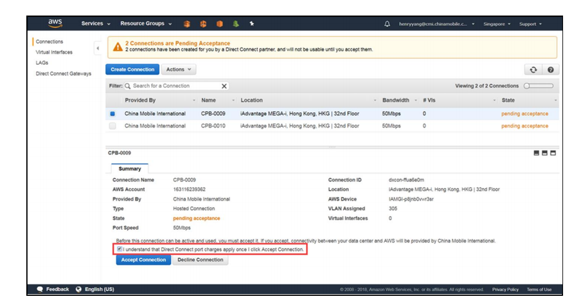
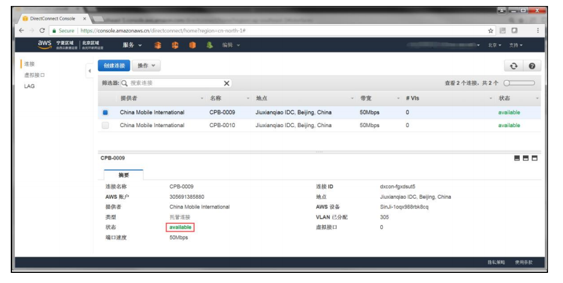
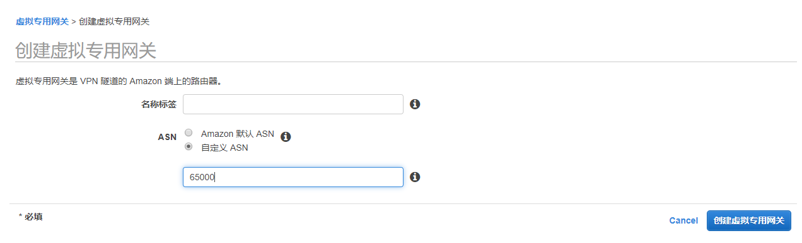
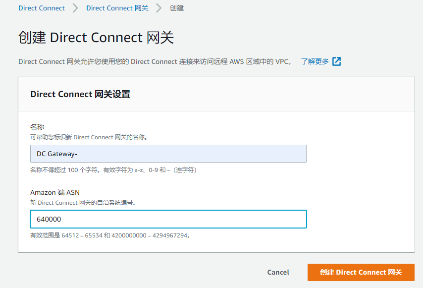
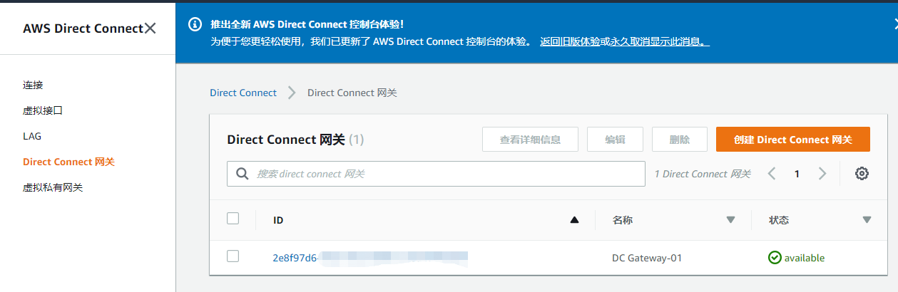

# AWS专线配置
## IDC机房 to AWS云的专线配置
- 准备工作，由或者伙伴将物理链路打通。然后AWS的DX后台会出现专线连接请求。

- 点击同意，完成专线的准备工作。

- 获取以下配置，ASN、VLAN ID、BGP ASN、BGP Password、CMI Router Peer IP、Custom Route Peer IP
- 在VPC的控制台上，点击创建虚拟专用网关VGW，填入名称标签（Name Tag）和ASN（选择自定义ASN）

- 在DX的控制台上，选择Direct Connect 网关，选择创建Direct Connect 网关，创建网关
- 填写自定义名称、Amazon端的ASN。完成创建Direct Connect 网关。

