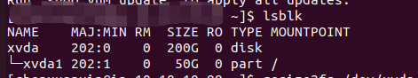
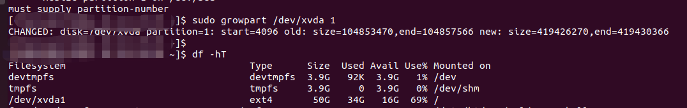
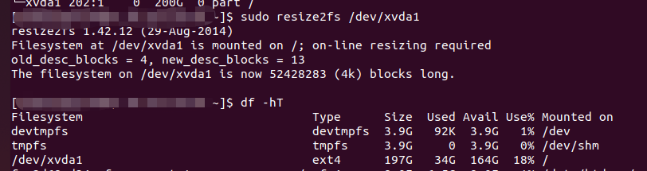

## AWS上对EBS进行扩容
分为以下三个步骤：

1. 扩容使用中的 EBS 卷，使用lsblk检查EBS卷是否扩容成功
   
2. 扩容分区
   ```bash
   # 格式：growpart diskname part
   growpart /dev/xvda 1
   ```
   
3. 扩容文件系统
   ```bash
   resize2fs /dev/xvda1
   ```
   
## 参考信息
[Amazon EBS弹性卷修改实践](https://aws.amazon.com/cn/blogs/china/amazon-ebs-elastic-volumes/)