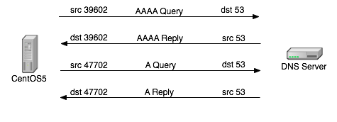
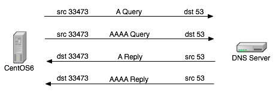

## CentOS6的DNS解析过程分析
### resolve.conf的超时(timeout)和重试(attempts)机制
* 默认情况下，timeout为5秒、attempts为2次
### 解决curl Couldn’t resolve host或dns解析慢
1. 在RHEL5 / CentOS5 / Ubuntu 10.04等linux下，DNS的解析请求过程。
   1. 主机从一个随机的源端口，请求 DNS 的 AAAA 记录，
   2. 主机接受 DNS 服务器返回AAAA记录，
   3. 主机从一个另一个随机的源端口，请求 DNS 的 A 记录，
   4. 主机 DNS 服务器返回A记录，
2. 在RHEL6 / CentOS6下，DNS 的解析过程；交互过程有所不同。下面3、4并没有严格的先后顺序，实际的顺序受网络环境，服务器环境的影响。
   1. 主机从一个随机的源端口，请求 DNS 的 A 记录，
   2. 主机从同一个源端口，请求 DNS 的 AAAA 记录，
   3. 主机接受 DNS 服务器返回 A 记录，
   4. 主机接受 DNS 服务器返回 AAAA 记录，
3. 理论上讲 CentOS6 的这种工作机制，效率更高，端口复用度更高，能节省更多的资源。但是这里也同样存在着一个问题。比如在存在防火墙等机制的网络环境中，同样源目的ip,同样源目的port，同样的第4层协议的连接会被防火墙看成是同一个会话，因此会存在返回包被丢弃现象。如下图。
   1. 主机从一个随机的源端口，请求 DNS 的 A 记录。
   2. 主机从同一个源端口，请求 DNS 的 AAAA 记录。
   3. 主机先收到 DNS 返回的 AAAA 记录。
   4. 防火墙认为本次交互通信已经完成，关闭连接。
   5. 于是剩下的 DNS 服务器返回的A记录响应包被防火墙丢弃。
   6. 等待5秒超时之后，主机因为收不到A记录的响应，重新通过新的端口发起A记录查询请求，此后的机制等同于 CentOS5 。
   7. 主机收到 DNS 的 A 记录响应。
   8. 主机从另一个新的源端口发起 AAAA 。
   9. 主机收到 DNS 的 AAAA 记录响应。
4. 我们看到在这个解析的序列里面，DNS 解析有5秒的延迟发生。所以当用linux系统安装大量远程包的时候宏观上看延迟就非常大了（linux是不缓存 DNS 解析记录的）。CentOS 6 和 CentOS 7 的 DNS 解析机制中，发送 IPV4 DNS 和 IPV6 DNS 请求使用了相同的网络五元组，此时应开启 single-request-reopen 配置，一旦出现同一 socket 发送的两次请求处理，解析端发送第一次请求后会关闭 socket，并在发送第二次请求前打开新的 socket。配置成功后不需要重启实例即可生效。
5. 我们通过修改resolve.conf配置文件，关闭系统的IPv6，来避免问题发生。
```bash
cat >> /etc/resolv.conf<<EOF
options single-request-reopen timeout:2 attempts:2
EOF

#修改完成后，需要重启机器使其生效
sysctl -w net.ipv6.conf.all.disable_ipv6 = 1
sysctl -w net.ipv6.conf.default.disable_ipv6 = 1
```
---
## DNS检查工具
要测试，不要使用 dig, host, nslook 这类工具，因为他们并没有调用 resolver 的库，可以使用 getent 来测试。上面提到的只是一些诊断的工具，对于日常的应用来说，包括 web server、mail client、db 以及各种 app server 等等，任何使用 glibc resolver 都需要经过 resolv.conf 文件。
对于 libresolv 来说，只认 resolv.conf 的前三个 nameserver，所以写的再多也没什么意义。正常情况下，resolver 会从上至下进行解析，每个 nameserver 等待 timeout 的时间，如果一直到第三个都没结果，resolver 会重复上面的步骤 (attempts – 1) 次。
最后，记得 dig, nslook 只会解析 resolv.conf 的内容，而不会解析 hosts 里面内容，所以如果想让 dig 解析 hosts 里面的内容，可以通过 dnsmasq 实现。
### 参考资料
* [resolve.conf的超时(timeout)与重试(attempts)机制](http://jaseywang.me/2015/01/02/resolv-conf-%E7%9A%84%E8%B6%85%E6%97%B6timeout%E4%B8%8E%E9%87%8D%E8%AF%95attempts%E6%9C%BA%E5%88%B6/)