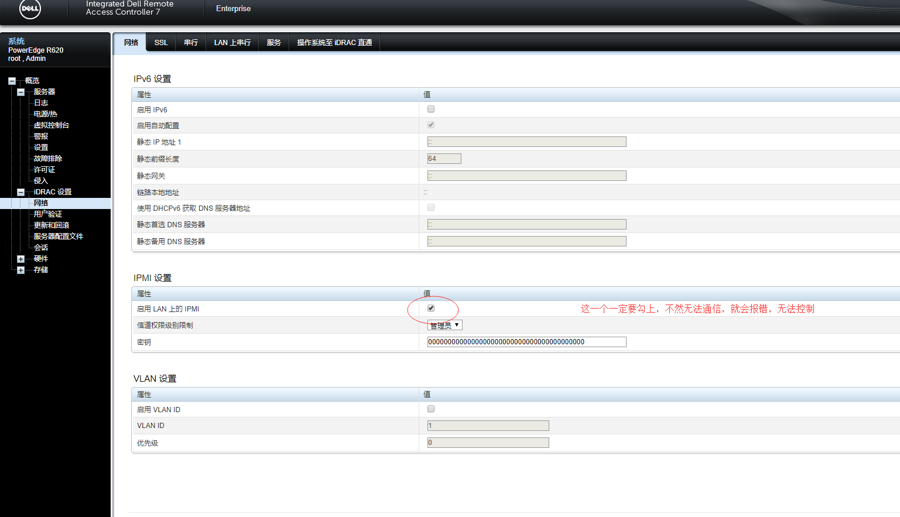

## 使用OpenIPMI工具对idrac卡进行配置。确认已安装OpenIPMI工具包
* 使用的机型为PowerEdge R730
* 使用的操作系统为CentOS 7
---
```bash
yum install OpenIPMI ipmitool
systemctl start ipmi
```
### ipmitool工具的参数说明
```bash
-I 指定接口
    open          Linux OpenIPMI Interface [default]
	imb           Intel IMB Interface
	lan           IPMI v1.5 LAN Interface
	lanplus       IPMI v2.0 RMCP+ LAN Interface
```
---
### 通过ipmitool修改idrac卡密码、修改用户名
```bash
ipmitool user set password ID new-password
ipmitool user set name ID username
```
### 通过ipmitool修改iDRAC卡的IP地址
```bash
ipmitool -I open lan set 1 ipaddr  192.168.0.120
```
### 通过ipmitool修改idrac卡的网口模式
```bash
#设置idrac卡网口模式为共享网口2
ipmitool -I open delloem lan set shared with lom2

#获取idrac卡网络设置信息
ipmitool -I open delloem lan get

#设置idrac卡使用静态IP
ipmitool -I open lan set 1 ipsrc static
```
### 通过ipmitool远程获取主机电源状态
```bash
ipmitool –H 192.168.0.120 -I lanplus –U root –P root chassis power status
ipmitool –H 192.168.0.120 -I lanplus –U root –P root chassis power on
ipmitool –H 192.168.0.120 -I lanplus –U root –P root chassis power off
```
### 通过ipmitool打印idrac卡信息
```bash
ipmitool -I open lan print 1
```
### 通过ipmitool重启iDRAC卡
```bash
ipmitool -I open mc reset cold
```
---
## 问题记录
* 使用ipmitool -H IP -I lanplus chassis power status遇到Error: Unable to establish IPMI v2 / RMCP+ session。需要开启iDRAC的IPMI功能，使用下面其中一个方法
    * 使用ssh登陆idrac，开启IPMI功能。
        ```bash
        /admin1->racadm set iDRAC.IPMILan.Enable Enabled
        ```
    * 登陆web控制台，开启IPMI功能