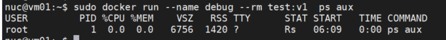

## Dockefile的CMD与ENTRYPOINT区别
---
### exec模式与shell模式
> CMD 和 ENTRYPOINT 指令都支持 exec 模式和 shell 模式的写法，所以要理解 CMD 和 ENTRYPOINT 指令的用法，就得先区分 exec 模式和 shell 模式。这两种模式主要用来指定容器中的不同进程为 1 号进程。了解 linux 的朋友应该清楚 1 号进程在系统中的重要地位。

- exec模式
  - 使用 exec 模式时，容器中的任务进程就是容器内的 1 号进程
  - exec 模式的特点是不会通过 shell 执行相关的命令，所以像 $HOME 这样的环境变量是取不到的
- shell模式
  - 使用 shell 模式时，docker 会以 /bin/sh -c "task command" 的方式执行任务命令。也就是说容器中的 1 号进程不是任务进程而是 bash 进程
### CMD 指令
- CMD 指令的目的是：为容器提供默认的执行命令。CMD 指令有三种使用方式，
  - ENTRYPOINT 提供默认的参数，CMD ["param1","param2"]
  - exec模式，CMD ["executable", "param1", "param2"]
  - shell模式，CMD command param1 param2
- 命令行参数可以覆盖CMD指令的设置，但只能是重写，却不能给CMD中的命令通过命令行传递参数
  - 例子：使用此dockerfile创建镜像，在启动容器时我们通过命令行指定参数 ps aux 覆盖默认的 top 命令
    ```bash
    cat > dockerfile <<EOF
    FROM ubuntu
    CMD ["top"]
    EOF

    # 构建镜像test:v1
    docker build . -t test:v1

    # 运行进行test:v1
    docker run --name debug --rm test:v1  ps aux
    ```
  - 
    从上图可以看到，命令行上指定的 ps aux 命令覆盖了 Dockerfile 中的 CMD [ "top" ]。实际上，命令行上的命令同样会覆盖 shell 模式的 CMD 指令。
### ENTRYPOINT 指令
- ENTRYPOINT 指令的目的也是为容器指定默认执行的任务。exec 模式和 shell 模式的基本用法和 CMD 指令是一样的，下面我们介绍一些比较特殊的用法。
  - exec 模式，ENTRYPOINT ["executable", "param1", "param2"]
  - shell 模式，ENTRYPOINT command param1 param2
---
### 同时使用 CMD 和 ENTRYPOINT 的情况
> 对于 CMD 和 ENTRYPOINT 的设计而言，多数情况下它们应该是单独使用的。当然，有一个例外是 CMD 为 ENTRYPOINT 提供默认的可选参数。
- 指定 ENTRYPOINT  指令为 exec 模式时，命令行上指定的参数会作为参数添加到 ENTRYPOINT 指定命令的参数列表中。
- 指定 ENTRYPOINT  指令为 shell 模式时，会完全忽略命令行参数：

> 我们大概可以总结出下面几条规律：
  - 如果 ENTRYPOINT 使用了 shell 模式，CMD 指令会被忽略。
  - 如果 ENTRYPOINT 使用了 exec 模式，CMD 指定的内容被追加为 ENTRYPOINT 指定命令的参数。
  - 如果 ENTRYPOINT 使用了 exec 模式，CMD 也应该使用 exec 模式。
  - 真实的情况要远比这三条规律复杂，好在 docker 给出了官方的解释，如下图所示：
    |-|	No ENTRYPOINT|	ENTRYPOINT exec_entry p1_entry	|    ENTRYPOINT ["exec_entry", "p1_entry"]|
    |:-|:-|:-|:-|
    |No CMD|error, not allowed|/bin/sh -c exec_entry p1_entry|exec_entry p1_entry|
    |CMD ["exec_cmd", "p1_cmd"]|exec_cmd p1_cmd|/bin/sh -c exec_entry p1_entry|	exec_entry p1_entry exec_cmd p1_cmd|
    |CMD ["p1_cmd", "p2_cmd"]|p1_cmd p2_cmd|/bin/sh -c exec_entry p1_entry|exec_entry p1_entry p1_cmd p2_cmd|
    |CMD exec_cmd p1_cmd|/bin/sh -c exec_cmd p1_cmd|/bin/sh -c exec_entry p1_entry|exec_entry p1_entry /bin/sh -c exec_cmd p1_cmd|

---
### COPY 指令
- 复制内容到镜像
  - 格式：COPY <src> <dest> 
  - 详解：复制本地主机的 \<src\> 下内容（新文件、目录或远程文件 URL）到镜像中的 \<dest\>，目标路径不存在时，会自动创建。\<src\>：可以是 Dockerfile 所在目录的一个相对路径（文件或目录）\<dest\>：可以是镜像内绝对路径，或者相对于工作目录（WORKDIR）的相对路径
  - 路径：支持正则表达式
- 两种格式
  ```bash
  COPY [--chown=<user>:<group>] [--chmod=<perms>] <src>... <dest>
  COPY [--chown=<user>:<group>] [--chmod=<perms>] ["<src>",... "<dest>"]
  --chown
  仅适用于 linux 上的 dockerfile，在 window 上没有用户、组的概念
  ```
- 详解：
> \<src\> 是目录，则复制目录的全部内容，包括文件系统元数据，不会复制目录本身，只会复制其内容
```bash
COPY dir /mydir/
```
> \<src\> 是任何其他类型的文件，则将其与其元数据一起单独复制，\<dest\> 以斜杠 / 结尾，它将被视为一个目录，并且 \<src\> 的内容将写入，\<dest\>/base(\<src\>)
```bash
COPY file.txt /mydir
```
> 指定了多个 <src> 资源，或者由于使用了通配符则 <dest> 必须是一个目录，并且必须以斜杠 / 结尾
```bash
COPY test1.txt test2.txt /mydir/
```
> <dest> 不以斜杠结尾它将被视为常规文件，并且 <src> 的内容将写入 <dest>

COPY test.txt /mytext
复制
> <dest> 不存在路径中所有缺失的目录都会自动创建

COPY test.txt /dir/test/my/
复制
注意事项

> <src> 的内容发生变化，第一个遇到的 COPY 指令将使来自 Dockerfile 的所有后续指令的缓存无效，这包括使 RUN 指令的缓存无效

```bash
FROM centos
# 添加文件到目录下
COPY test.txt /mydir/

# 将文件内容写入 mytest
COPY test.txt /mytest

# 压缩文件,自动解压
COPY jmeter.log.zip /myzipdir/

# 添加目录
COPY TeamFile /

# 其他文件
COPY jmeter.log /mydir/

# 多个文件
COPY test1.txt test2.txt /mydir/

# 通配符,dest 不存在自动创建
COPY test*.txt /mydir/test/

# 特殊字符串
COPY COPY[[]0].txt /mydir/

WORKDIR /data

# 相对路径
COPY test.txt test/
```
---
> ADD 和 COPY 的区别和使用场景，ADD 支持添加远程 url 和自动提取压缩格式的文件，COPY 只允许从本机中复制文件
COPY 支持从其他构建阶段中复制源文件（--from），根据官方 Dockerfile 最佳实践，除非真的需要从远程 url 添加文件或自动提取压缩文件才用 ADD，其他情况一律使用 COPY。注意，ADD 从远程 url 获取文件和复制的效果并不理想，因为该文件会增加 Docker Image 最终的大小，相反，应该使用 curl wget 来获取远程文件，然后在不需要它时进行删除

---
### 参考连接
- [ENTRYPOINT的解释](https://docs.docker.com/engine/reference/builder/?spm=a2c6h.12873639.0.0.39e74a0a3c0UnH#entrypoint)
- [Dockerfile 中的 CMD 与 ENTRYPOINT](https://www.cnblogs.com/sparkdev/p/8461576.html)
- [Dockerfile（11） - COPY 指令详解](https://cloud.tencent.com/developer/article/1896354)