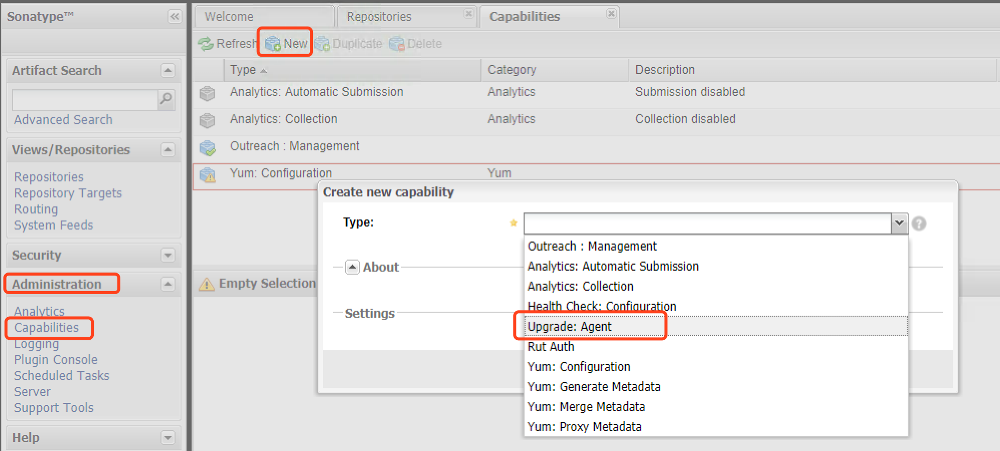
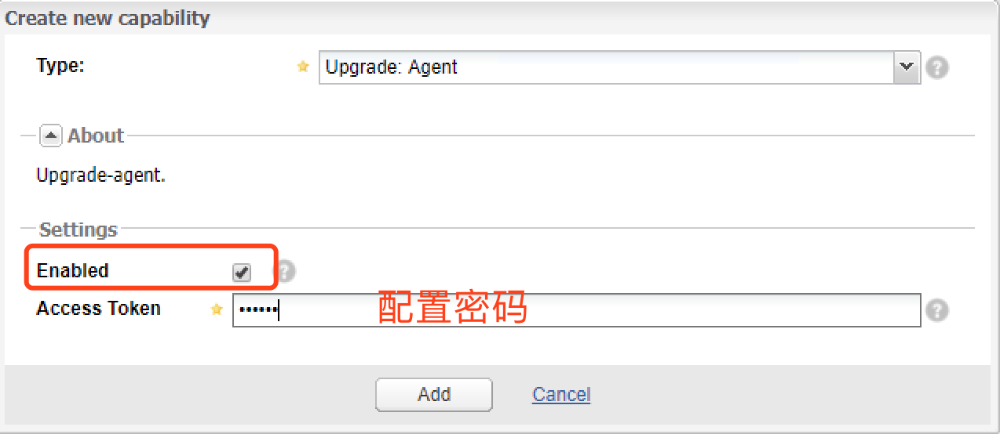
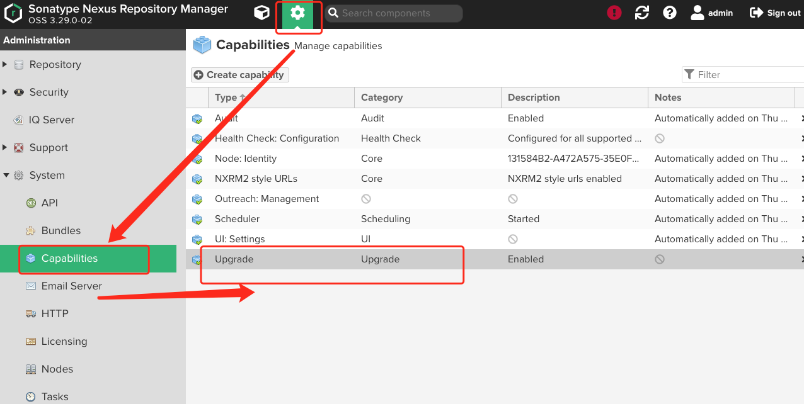
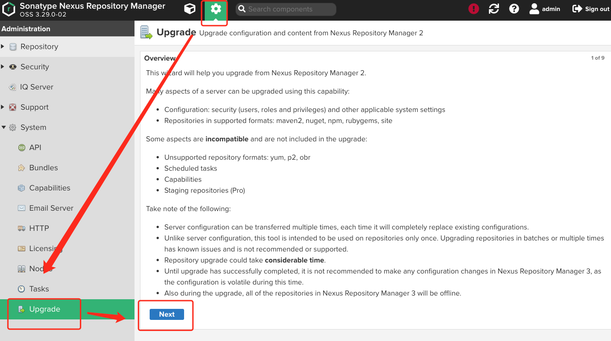
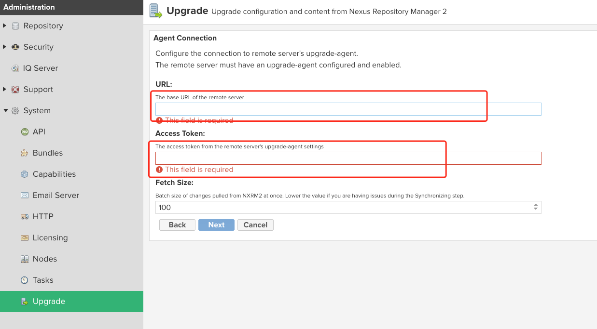

## 升级nexus版本
- nexus 2 仓库升级至nexus 3。
  - 注意：3.71.0版本以后，要求使用OpenJDK17
  - 首先需要将nexus 2 版本的仓库升级至Upgrade to Nexus Repository 2.15.2
  - 然后再Nexus Repository 3.76.0。支持冲nexus2 升级到3的最后一个版本
- 迁移前准备
  - nexus 2 配置，启用upgrade agent和配置对应的访问密码
    
    
  - nexus 3 配置，
    - 在System - Capablities中创建upgrade capability
      
    - 在System - Upgrade中开启升级步骤
      
    - 在url中填入nexus的访问地址。例如：http://192.168.1.1:8081/nexus。在Access Tokens中填入nexus 2 的访问密码。根据提示完成同步
      
---
### 参考文档
- [Upgrade from Nexus Repository 2](https://help.sonatype.com/en/upgrade-from-nexus-repository-2.html)
- [Nexus从2.x升级到3.x的升级过程](https://mafgwo.cn/2021/01/15/2009_Nexus%E4%BB%8E2.x%E5%8D%87%E7%BA%A7%E5%88%B03.x%E7%9A%84%E5%8D%87%E7%BA%A7%E8%BF%87%E7%A8%8B/)