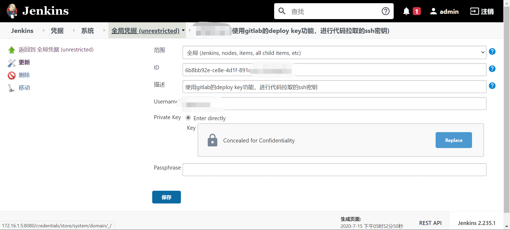
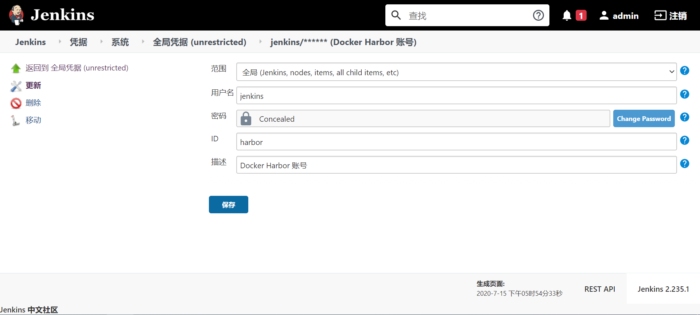
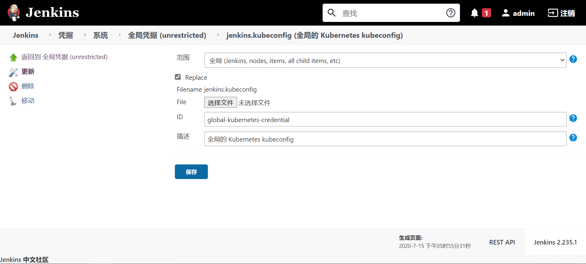

## Jenkins 与 Kubernetes的CI 与CD
Jenkins安装的插件
- Config File Provider：Config File Provider 插件作用就是提供在 Jenkins 中存储 properties、xml、json、settings.xml 等信息，可以在执行 Pipeline 过程中可以写入存储的配置。例如，存入一个 Maven 全局 Settings.xml 文件，在执行 Pipeline Job 时候引入该 Settings.xml ，这样 Maven 编译用的就是该全局的 Settings.xml。
- Kubernetes Cli：Kubernetes Cli 插件作用是在执行 Jenkins Job 时候提供 kubectl 与 Kubernetes 集群交互环境。可以在 Pipeline 或自由式项目中允许执行 kubectl 相关命令。它的主要作用是提供 kubectl 运行环境，当然也可以提供 helm 运行环境。
### 配置相关凭据
- 选择 凭据->系统->全局凭据->添加凭据 来新增 Git、Docker Harbor、Kubernetes 等认证凭据。
1. Git认证凭据(ssh key)
   
2. Docker Harbor认证凭据
   
3. Kubernetes认证凭据（kube.config）
   

### 创建模板文件
之前安装了 Config File Provider 插件，该插件功能就是可以在 Jenkins 上存储一些配置文件，例如，我们经常使用到的 yaml、properties、Dockerfile、Maven 的 Settings.xml 等文件，都可以存储到 Jenkins 该插件中。打开 系统管理->Managed files ，在其中新增几个文件：
- Maven 配置文件： Maven 的 Settings.xml 配置文件。
  - 选择 Add a new Config—>Global Maven settings.xml 来新增一个 Maven 全局 Settings.xml 文件：
    - ID：global-maven-settings
    - Name：MavenGlobalSettings
    - Comment：全局 Maven Settings.xml 文件
    - Content：mvn的settings.xml
- Dockerfile 文件： Dockerfile 脚本。
  - 选择 Add a new Config—>Custom file 来新增一个 Dockerfile 文件：
    - ID：global-dockerfile-file
    - Name：Dockerfile
    - Comment：全局 Dockerfile 文件
    - Content：Dockerfile的文件内容
- Kubernetes 部署文件： 将应用部署到 kubernetes 的 Deployment 文件。
  - 选择 Add a new Config—>Custom file 来新增一个 Kubernetes 部署文件：
    - ID：global-kubernetes-deployment
    - Name：deployment.yaml
    - Comment：全局 Kubernetes 部署文件
    - Content：deployment.yaml的内容