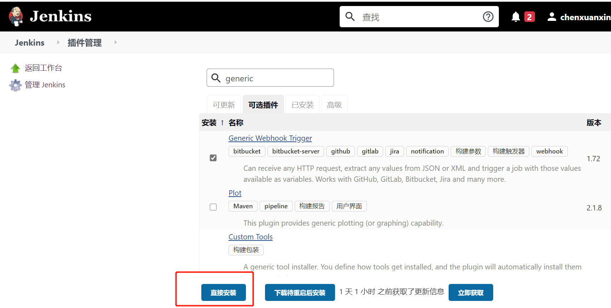

## Jenkins Hook配置
1. 安装Generic Webhook Trigger插件，此插件是git webhook的高阶应用，安装后会暴露出来一个公共API，GWT插件接收到 JSON 或 XML 的 HTTP POST 请求后，根据我们配置的规则决定触发哪个Jenkins项目。
   
2. 定义需要的变量

---
## 参考连接
- [Generic Webhook Trigger Plugin](https://github.com/jenkinsci/generic-webhook-trigger-plugin)
- [玩转触发器之Jenkins Generic Webhook使用技巧](https://www.51cto.com/article/682104.html)