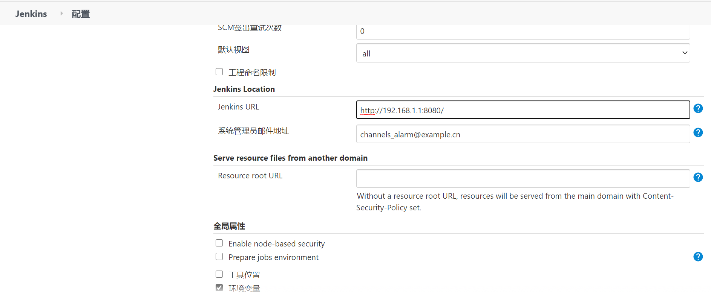
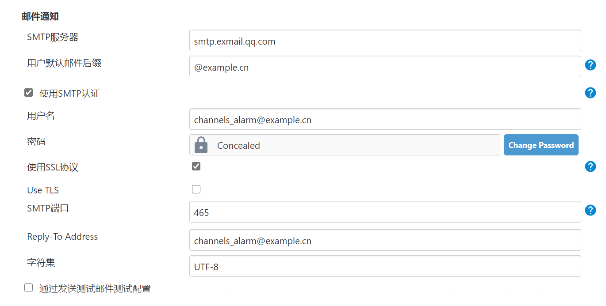

## Jenkins使用记录
### 批量修改任务的配置文件
- 在Jenkins的工作目录下，假设工作目录为/data/jenkins。任务配置文件的路径为/data/jenkins/joub_name/config.xml
- 修改完成后，需要在Jenkins的web界面上操作：【系统管理】-> 【读取设置】或重启jenkins重新读取配置文件。默认情况下，Jenkins会将配置加载到内存中

### 参数化构建选择tag
- 需要安装插件Git Parameter
- 在任务配置中，添加参数化构建过程


### 重置Jenkins的build序号
在Jenkins的系统管理 - 脚本命令行中执行
item = Jenkins.instance.getItemByFullName("your-job-name-here")
//THIS WILL REMOVE ALL BUILD HISTORY
item.builds.each() { build ->
  build.delete()
}
item.updateNextBuildNumber(1)


Jenkins.instance.allItems.each() { 
  item -> item.builds.each() { 
    build -> build.delete()
  }
  item.updateNextBuildNumber(1001)
}  

### 配置smtp发送邮件
系统管理 -> 配置
- 配置：系统管理员邮件地址
  
- 邮件通知：配置SMTP服务器地址、邮箱后缀、用户名、密码、SMTP端口
  
- 在pipeline中配置邮件发送
  ```bash
  pipeline { 
      agent any 
  
      parameters {
          省略内容……
      }
      environment {
          省略内容……
      }
      stages {
          省略内容……
      }
      post {
          success {
              emailext (
                  subject: "SUCCESSFUL: Job '${env.JOB_NAME} [${env.BUILD_NUMBER}]'",
                  body: """<p>SUCCESSFUL: Job '${env.JOB_NAME} [${env.BUILD_NUMBER}]':</p>
                      <p>Check console output at "<a href="${env.BUILD_URL}">${env.JOB_NAME} [${env.BUILD_NUMBER}]</a>"</p>""",
                  to: "user1@qq.com,user2@qq.com",
                  from: "admin@sina.com"
              )
          }
          failure {
              emailext (
                  subject: "FAILED: Job '${env.JOB_NAME} [${env.BUILD_NUMBER}]'",
                  body: """<p>FAILED: Job '${env.JOB_NAME} [${env.BUILD_NUMBER}]':</p>
                      <p>Check console output at "<a href="${env.BUILD_URL}">${env.JOB_NAME} [${env.BUILD_NUMBER}]</a>"</p>""",
                  to: "user1@qq.com,user2@qq.com",
                  from: "admin@sina.com"
              )
          }
      }
  }
  ```