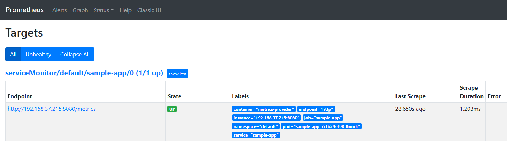

## K8S基于自定义指标的HPA实战

### 实验环境
- k8s: 1.22
- 
### 基于自定义指标的HPA实战
- 
1. 配置controller-manager
> 一般而言通过kubeadm部署的k8s集群不需要进行api-server的手动配置，所需要的配置已经默认开启。我们只需要配置kube-controller-manager的参数即可。
```bash
# HPA控制器同步Pod副本数量的时间，默认15s
--horizontal-pod-autoscaler-sync-period=5s
# 执行缩容操作时等待的时长，默认5min
--horizontal-pod-autoscaler-downscale-stabilization=1m0s
# 等待Pod到达Ready状态的时延，默认30s
--horizontal-pod-autoscaler-initial-readiness-delay=30s
# 扩缩容计算结果容忍度
--horizontal-pod-autoscaler-tolerance=0.1
```
2. 创建对象pod
> 该pod会在/metrics路径下提供名为http_requests_total的指标。
```bash
cat > demo.yaml <<EOF
apiVersion: v1
kind: Service
metadata:
  name: sample-app
  labels:
    app: sample-app
spec:
  selector:
    app: sample-app
  ports:
  - name: http
    port: 80
    targetPort: 8080
---
apiVersion: apps/v1
kind: Deployment
metadata:
  name: sample-app
  labels:
    app: sample-app
spec:
  replicas: 1
  selector:
    matchLabels:
      app: sample-app
  template:
    metadata:
      labels:
        app: sample-app
    spec:
      containers:
      - image: luxas/autoscale-demo:v0.1.2
        name: metrics-provider
        ports:
        - name: http
          containerPort: 8080
EOF

kubectl apply -f demo.yaml
```
- 执行结果
3. 创建ServiceMonitor对象，用于监控程序提供的指标；注意:这里的port:http一定要和上面部署的Service对象中port的名称一致。应用该对象后稍等2~3分钟打开promethes的页面，即可发现相应的监控项已经是up状态：
```bash
cat > service-monitor.yaml <<EOF
kind: ServiceMonitor
apiVersion: monitoring.coreos.com/v1
metadata:
  name: sample-app
  labels:
    app: sample-app
spec:
  selector:
    matchLabels:
      app: sample-app
  endpoints: 
  - port: http
EOF
```
- 执行结果
4. 配置Adapter
> 以上配置的指标作http_requests_total为一种持续增长的值，不能反映单位时间内的增长量，不能用作HPA的依据。需要进行适当地转换，打开adapter的配置，添加如下配置并应用：
```bash
kubectl edit configmap -n monitoring adapter-config
添加
config.yaml: |
    rules:
    #sum(rate(http_requests_total{namespace="xx",pod="xx"}[1m])) by pod:1分钟内全部pod指标http_requests_total的总和的每秒平均值
    - metricsQuery: sum(rate(<<.Series>>{<<.LabelMatchers>>}[1m])) by (<<.GroupBy>>)                                       
      #将metricsQuery计算的结果赋给新的指标`http_requests`并提供给HPA控制器
      name:
        as: "${1}"
        matches: ^(.*)_total$
      resources:
        template: <<.Resource>>
      seriesFilters:
      - isNot: .*_seconds_total$
      seriesQuery: '{namespace!="",__name__=~"http_requests_.*"}'
```
> **应用configmap完成后删除adapter Pod，使新的配置生效。**
```bash
kubectl rollout restart -n monitoring deployment prometheus-adapter

```
5. 自定义API资源
> 创建名为v1beta1.custom.metrics.k8s.io的自定义聚合API资源
```bash
# k8s 1.22版本以后，apiregistration已经废弃v1beta1的版本，改用v1版本
cat > custom.yaml <<EOF
apiVersion: apiregistration.k8s.io/v1
kind: APIService
metadata:
  name: v1beta1.custom.metrics.k8s.io
spec:
  service:
    name: prometheus-adapter
    namespace: monitoring
  group: custom.metrics.k8s.io
  version: v1beta1
  insecureSkipTLSVerify: true
  groupPriorityMinimum: 100
  versionPriority: 100
EOF

kubectl apply -f custom.yaml

# 检查
kubectl get apiservices|grep custom

# 正常的结果应为，若第三列为False，
# 1. 检查Prometheus-adapter是否正常运行
# 2. adapter-config是否添加新配置
# 3. 更新adapter-config后是否将Prometheus-adapter重启
v1beta1.custom.metrics.k8s.io          monitoring/prometheus-adapter   True        58m
```
7. 创建HPA控制器资源
```bash
cat > hpa.yaml <<EOF
kind: HorizontalPodAutoscaler
apiVersion: autoscaling/v2beta2
metadata:
  name: sample-app
spec:
  scaleTargetRef:
    apiVersion: apps/v1
    kind: Deployment
    name: sample-app
  minReplicas: 1
  maxReplicas: 10
  metrics:
  - type: Pods
    pods:
      metric:
        name: http_requests
      target:
        type: AverageValue
        averageValue: 500m
EOF

kubectl apply -f hpa.yaml
```
- 通过聚合API查询指标数据,pod指标成功采集
  ```bash
  kubectl get --raw "/apis/custom.metrics.k8s.io/v1beta1/namespaces/default/pods/*/http_requests" | jq .
  ```
- 执行结果1
- 执行结果2
8. 验证动态扩缩容: 在其他终端请求sample-app的地址进行压测
   ```bash
   for i in {1..100000};do wget -q -O- sample-app-svc-ip > /dev/null;done
   ```
- 执行结果1
---
### 参考信息
- [基于自定义指标的HPA实战](https://www.cnblogs.com/ltzhang/p/14529745.html)