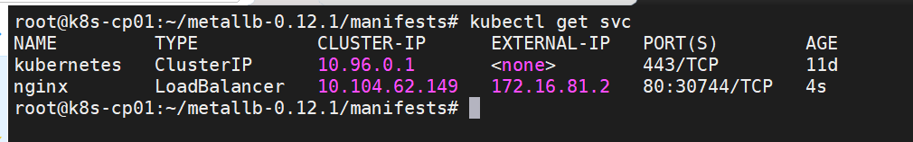
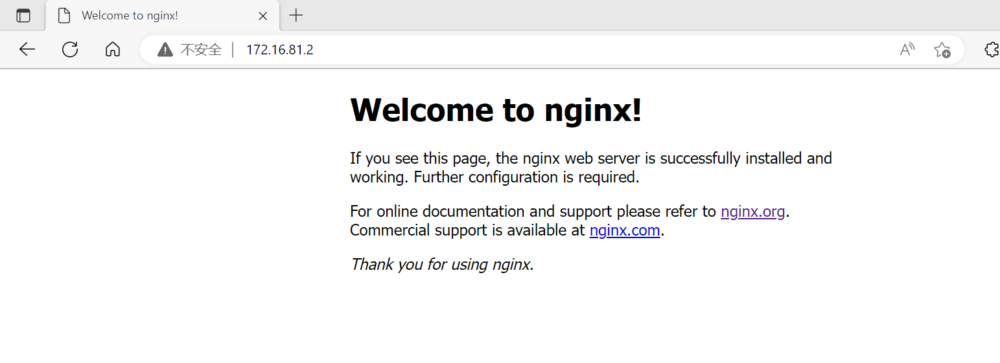

## k8s的MetalLB负载均衡器
> MetalLB 是为裸机Kubernetes集群实现的负载均衡器，使用标准路由协议ARP或BGP。Kubernetes官方没有为裸机集群提供网络负载均衡器（LoadBalancer类型的服务）的实现。各家云厂商（GCP、AWS、Azure…）有相应实现，但必须运行在自身的云环境上才能使用，如果没有在受支持的IaaS平台（GCP、AWS、Azure…）上运行，那么负载均衡器在创建时将无限期地保持pending状态。

> 裸机集群环境剩下两个较小的工具来将用户流量引入他们的集群，“NodePort”和“externalIPs”服务。这两种选择在生产使用方面都有很大的缺点，这使得裸机集群成为 Kubernetes 生态系统中的二等公民。

> MetalLB 旨在通过提供与标准网络设备集成的网络负载均衡器实现来纠正这种不平衡，以便裸机集群上的外部服务也尽可能“正常工作”。

> MetalLB 由David Anderson开发，直到 2019 年 3 月，MetalLB 的版权归谷歌所有，目前已经脱离谷歌，原作者现在已经授权一个维护人员团队协助推进项目。

> 官方网站：https://metallb.universe.tf

> 项目地址：https://github.com/metallb/metallb
---
### MetalLB安装
- 环境信息
  1. MetalLB版本: 0.12.1
  2. Kubernetes集群: 1.22.10
  3. 网络插件: calico
  4. 如果在 IPVS 模式下使用 kube-proxy，从 Kubernetes v1.14.2 开始，必须启用严格的 ARP模式。请注意，如果使用 kube-router 作为服务代理，则不需要这个，因为它默认启用严格的 ARP。通过一下方式修改：
     ```bash
     kubectl get configmap kube-proxy -n kube-system -o yaml | \
     sed -e "s/strictARP: false/strictARP: true/" | \
     kubectl apply -f - -n kube-system
     ```
- 0.12.1版本安装
  ```bash
  wget https://github.com/metallb/metallb/archive/refs/tags/v0.12.1.tar.gz
  tar xf v0.12.1.tar.gz
  cd metallb-0.12.1
  
  # 创建命名空间
  kubectl apply -f manifests/namespace.yaml
  
  # 部署metallb
  kubectl apply -f manifests/metallb.yaml

  # 检查部署情况，包含了 “controller” deployment,和 the “speaker” DaemonSet.
  kubectl -n metallb-system get deployment
  kubectl -n metallb-system get daemonset

  # 配置Layer2模式
  cat > layer2-config.yaml <<EOF
  apiVersion: v1
  kind: ConfigMap
  metadata:
    namespace: metallb-system
    name: config
  data:
    config: |
      address-pools:
      - name: my-ip-space
        protocol: layer2
        addresses:
        - 172.16.81.0/28
  EOF
  kubectl apply -f layer2-config.yaml

  # 创建后端应用和服务测试
  kubectl apply -f manifests/ tutorial-2.yaml
  ```
- 0.13.7版本安装
  ```bash
  ### 设置ipvs模式，并启用严格ARP模式

  # see what changes would be made, returns nonzero returncode if different
  kubectl get configmap kube-proxy -n kube-system -o yaml | \
  sed -e "s/strictARP: false/strictARP: true/" | \
  kubectl diff -f - -n kube-system

  # actually apply the changes, returns nonzero returncode on errors only
  kubectl get configmap kube-proxy -n kube-system -o yaml | \
  sed -e "s/strictARP: false/strictARP: true/" | \
  kubectl apply -f - -n kube-system

  ### 安装manifest
  kubectl apply -f https://raw.githubusercontent.com/metallb/metallb/v0.13.7/config/manifests/  metallb-native.yaml

  ###配置IP池
  cat > ip.yaml <<EOF
  apiVersion: metallb.io/v1beta1
  kind: IPAddressPool
  metadata:
    name: cheap
    namespace: metallb-system
  spec:
    addresses:
    - 192.168.10.0/24
  EOF

  kubectl apply -f ip.yaml
  ```
- 查看service分配的EXTERNAL-IP


- 使用浏览器访问

---
### 参考信息
- [Metallb介绍：一个开源的k8s LB](https://zhuanlan.zhihu.com/p/103717169)
- [Kuberntes部署MetalLB负载均衡器](https://blog.csdn.net/networken/article/details/85928369)
- [官方文档](https://metallb.universe.tf/installation/)
- [Controlling automatic address allocation](https://metallb.universe.tf/configuration/_advanced_ipaddresspool_config/)