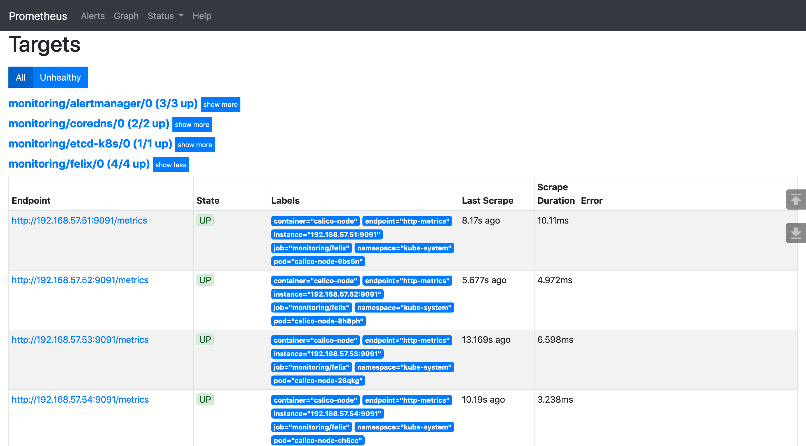

## 使用 Prometheus-Operator 监控 Calico
### 配置 Calico 以启用指标
1. 默认情况下 Felix 的指标是被禁用的，必须通过命令行管理工具 calicoctl 手动更改 Felix 配置才能开启，需要提前配置好命令行管理工具。这里使用的calico版本为3.14.0
   ```bash
   # 下载管理工具
   wget https://github.com/projectcalico/calicoctl/   releasesdownload/v3.15.0/calicoctl -O /usr/local/bin/calicoctl
   chmod +x /usr/local/bin/calicoctl
   ```
2. 需要设置 calicoctl 配置文件（默认是 /etc/calico/calicoctl.cfg）。
   1. 如果你的 Calico 后端存储使用的是 Kubernetes API，那么配置文件内容如下：
      ```bash
      cat /etc/calico/calicoctl.cfg
      apiVersion: projectcalico.org/v3
      kind: CalicoAPIConfig
      metadata:
      spec:
        datastoreType: "kubernetes"
        kubeconfig: "/root/.kube/config"
      ```
    2. 如果 Calico 后端存储使用的是 etcd，那么配置文件内容如下：
       ```bash
       # 你需要将其中的证书路径换成你的 etcd 证书路径。
       cat /etc/calico/calicoctl.cfg
       apiVersion: projectcalico.org/v3
       kind: CalicoAPIConfig
       metadata:
       spec:
         datastoreType: "etcdv3"
         etcdEndpoints: https://192.168.57.51:2379,https://192.168.       57.52:2379,https://192.168.57.53:2379
         etcdKeyFile: /opt/kubernetes/ssl/server-key.pem
         etcdCertFile: /opt/kubernetes/ssl/server.pem
         etcdCACertFile: /opt/kubernetes/ssl/ca.pem
       ```
3. 配置好了 calicoctl 之后就可以查看或修改 Calico 的配置了，先来看一下默认的 Felix 配置：
   ```bash
   calicoctl get felixConfiguration default -o yaml

   apiVersion: projectcalico.org/v3
   kind: FelixConfiguration
   metadata:
     creationTimestamp: "2020-06-25T14:37:28Z"
     name: default
     resourceVersion: "269031"
     uid: 52146c95-ff97-40a9-9ba7-7c3b4dd3ba57
   spec:
     bpfLogLevel: ""
     ipipEnabled: true
     logSeverityScreen: Info
     reportingInterval: 0s
   ```
4. 可以看到默认的配置中没有启用指标，需要手动修改配置，命令如下：
   ```bash
   calicoctl patch felixConfiguration default  --patch   '{"spec":{"prometheusMetricsEnabled": true}}'

   # Felix 暴露指标的端口是 9091，可通过检查监听端口来验证   开启指标：
   ss -nltp|grep 9091
   tcp    LISTEN     0      4096   [:   :9091               [::]:*                   users   ("calico-node",pid=13761,fd=9))

   curl -s http://localhost:9091/metrics
   # HELP felix_active_local_endpoints Number o   active        endpoints on this host.
   # TYPE felix_active_local_endpoints gauge
   felix_active_local_endpoints 1
   # HELP felix_active_local_policies Number of activ   policies        on this host.
   # TYPE felix_active_local_policies gauge
   felix_active_local_policies 0
   # HELP felix_active_local_selectors Number o   active        selectors on this host.
   # TYPE felix_active_local_selectors gauge
   felix_active_local_selectors 0
   ...
   ```
### Prometheus 采集 Felix 指标
1. 启用了 Felix 的指标后，就可以通过 Prometheus-Operator 来采集指标数据了。Prometheus-Operator 在部署时会创建 Prometheus、PodMonitor、ServiceMonitor、AlertManager 和 PrometheusRule 这 5 个 CRD 资源对象，然后会一直监控并维持这 5 个资源对象的状态。其中 Prometheus 这个资源对象就是对 Prometheus Server 的抽象。而 PodMonitor 和 ServiceMonitor 就是 exporter 的各种抽象，是用来提供专门提供指标数据接口的工具，Prometheus 就是通过 PodMonitor 和 ServiceMonitor 提供的指标数据接口去 pull 数据的。
2. ServiceMonitor 要求被监控的服务必须有对应的 Service，而 PodMonitor 则不需要，本文选择使用 PodMonitor 来采集 Felix 的指标。
3. PodMonitor 虽然不需要应用创建相应的 Service，但必须在 Pod 中指定指标的端口和名称，因此需要先修改 DaemonSet calico-node 的配置，指定端口和名称。先用以下命令打开 DaemonSet calico-node 的配置：
   ```bash
   kubectl -n kube-system edit ds calico-node   
   # 然后在线修改，在 spec.template.sepc.containers 中加入以   内容：
   ports:
   - containerPort: 9091
     name: http-metrics
     protocol: TCP
   # 创建 Pod 对应的 PodMonitor：
   cat > prometheus-podMonitorCalico.yaml <<EOF
   apiVersion: monitoring.coreos.com/v1
   kind: PodMonitor
   metadata:
     labels:
       k8s-app: calico-node
     name: felix
     namespace: monitoring
   spec:
     podMetricsEndpoints:
     - interval: 15s
       path: /metrics
       port: http-metrics
     namespaceSelector:
       matchNames:
       - kube-system
     selector:
       matchLabels:
         k8s-app: calico-node
   EOF   
   kubectl apply -f prometheus-podMonitorCalico.yaml
   ```
   - 有几个参数需要注意：
     - PodMonitor 的 name 最终会反应到 Prometheus 的配置中，作为 job_name。
     - podMetricsEndpoints.port 需要和被监控的 Pod 中的 ports.name 相同，此处为 http-metrics。
     - namespaceSelector.matchNames 需要和被监控的 Pod 所在的 namespace 相同，此处为 kube-system。
     - selector.matchLabels 的标签必须和被监控的 Pod 中能唯一标明身份的标签对应。
     - 最终 Prometheus-Operator 会根据 PodMonitor 来修改 Prometheus 的配置文件，以实现对相关的 Pod 进行监控。可以打开 Prometheus 的 UI 查看监控目标（注意 Labels 中有 pod="calico-node-xxx"，表明监控的是 Pod。）：
     
### 可视化监控指标
1. 采集完指标之后，就可以通过 Grafana 的仪表盘来展示监控指标了。官方提供的[dashboard json](https://github.com/projectcalico/calico/blob/master/manifests/grafana-dashboards.yaml)，然后将其中的 datasource 值 calico-demo-prometheus 替换为 prometheus。修改完了之后，将 json 内容导入到 Grafana：
2. 最后得到的 Felix 仪表盘如下图所示：