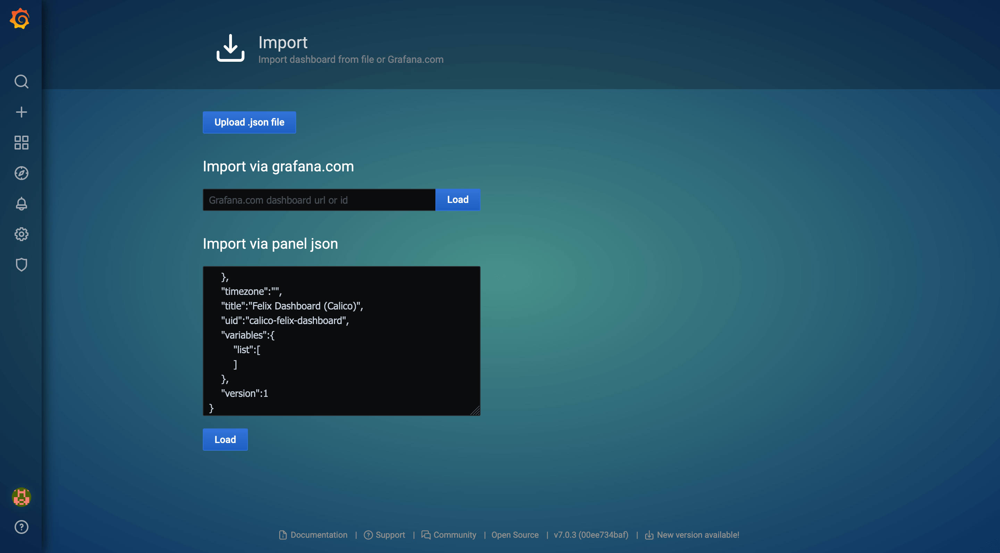
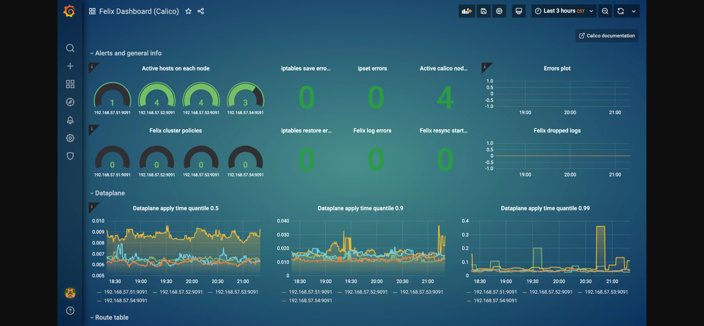

## 使用 Prometheus-Operator 监控 Calico
### 配置 Calico 以启用指标
1. 默认情况下 Felix 的指标是被禁用的，必须通过命令行管理工具 calicoctl 手动更改 Felix 配置才能开启，需要提前配置好命令行管理工具。这里使用的calico版本为3.14.0
   ```bash
   # 下载管理工具
   wget https://github.com/projectcalico/calicoctl/   releasesdownload/v3.15.0/calicoctl -O /usr/local/bin/calicoctl
   chmod +x /usr/local/bin/calicoctl
   ```
2. 需要设置 calicoctl 配置文件（默认是 /etc/calico/calicoctl.cfg）。
   1. 如果你的 Calico 后端存储使用的是 Kubernetes API，那么配置文件内容如下：
      ```bash
      cat /etc/calico/calicoctl.cfg
      apiVersion: projectcalico.org/v3
      kind: CalicoAPIConfig
      metadata:
      spec:
        datastoreType: "kubernetes"
        kubeconfig: "/root/.kube/config"
      ```
    2. 如果 Calico 后端存储使用的是 etcd，那么配置文件内容如下：
       ```bash
       # 你需要将其中的证书路径换成你的 etcd 证书路径。
       cat /etc/calico/calicoctl.cfg
       apiVersion: projectcalico.org/v3
       kind: CalicoAPIConfig
       metadata:
       spec:
         datastoreType: "etcdv3"
         etcdEndpoints: https://192.168.57.51:2379,https://192.168.57.52:2379,https://192.168.57.53:2379
         etcdKeyFile: /opt/kubernetes/ssl/server-key.pem
         etcdCertFile: /opt/kubernetes/ssl/server.pem
         etcdCACertFile: /opt/kubernetes/ssl/ca.pem
       ```
3. 开启Felix的指标
   ```bash
   calicoctl patch felixConfiguration default  --patch '{"spec":{"prometheusMetricsEnabled": true}}'

   # Felix 暴露指标的端口是 9091，可通过检查监听端口来验证   开启指标：
   ss -nltp|grep 9091
   tcp    LISTEN     0      4096   [:   :9091               [::]:*                   users   ("calico-node",pid=13761,fd=9))

   curl -s http://localhost:9091/metrics
   # HELP felix_active_local_endpoints Number o   active        endpoints on this host.
   # TYPE felix_active_local_endpoints gauge
   felix_active_local_endpoints 1
   # HELP felix_active_local_policies Number of activ   policies        on this host.
   # TYPE felix_active_local_policies gauge
   felix_active_local_policies 0
   # HELP felix_active_local_selectors Number o   active        selectors on this host.
   # TYPE felix_active_local_selectors gauge
   felix_active_local_selectors 0
   ...
   ```
4. 配置SVC
   ```bash
   kubectl apply -f - <<EOF
   apiVersion: v1
   kind: Service
   metadata:
     name: felix-metrics-svc
     namespace: kube-system
     labels:
       k8s-app: calico-node
   spec:
     selector:
       k8s-app: calico-node
     ports:
     - port: 9091
       name: calico-felix
       targetPort: 9091
   EOF
   ```
  5. 配置ServiceMonitor
     ```bash
     cat > servicemonitor-calico.yaml <<EOF
     apiVersion: monitoring.coreos.com/v1
     kind: ServiceMonitor
     metadata:
       name: calico-felix
       namespace: kube-system
       labels:
         k8s-app: calico-node
     spec:
       jobLabel: k8s-app
       endpoints:
       - port: calico-felix
         interval: 30s
       selector:
         matchLabels:
           k8s-app: calico-node
       namespaceSelector:
         matchNames:
         - kube-system
     EOF

     kubectl apply -f servicemonitor-calico.yaml
     ```
### Prometheus 采集 Felix 指标
1. 启用了 Felix 的指标后，就可以通过 Prometheus-Operator 来采集指标数据了。Prometheus-Operator 在部署时会创建 Prometheus、PodMonitor、ServiceMonitor、AlertManager 和 PrometheusRule 这 5 个 CRD 资源对象，然后会一直监控并维持这 5 个资源对象的状态。其中 Prometheus 这个资源对象就是对 Prometheus Server 的抽象。而 PodMonitor 和 ServiceMonitor 就是 exporter 的各种抽象，是用来提供专门提供指标数据接口的工具，Prometheus 就是通过 PodMonitor 和 ServiceMonitor 提供的指标数据接口去 pull 数据的。
2. ServiceMonitor 要求被监控的服务必须有对应的 Service，而 PodMonitor 则不需要，我们使用 ServiceMonitor 来采集 Felix 的指标。

### 可视化监控指标
1. 采集完指标之后，就可以通过 Grafana 的仪表盘来展示监控指标了。官方提供的[dashboard json](https://github.com/projectcalico/calico/blob/master/manifests/grafana-dashboards.yaml)，然后将其中的 datasource 值 calico-demo-prometheus 替换为 prometheus。修改完了之后，将 json 内容导入到 Grafana：
2. 最后得到的 Felix 仪表盘如下图所示：
---
### 参考信息
- [Monitor Calico component metrics](https://projectcalico.docs.tigera.io/maintenance/monitor/monitor-component-metrics)
- [Visualizing metrics via Grafana](https://projectcalico.docs.tigera.io/maintenance/monitor/monitor-component-visual)