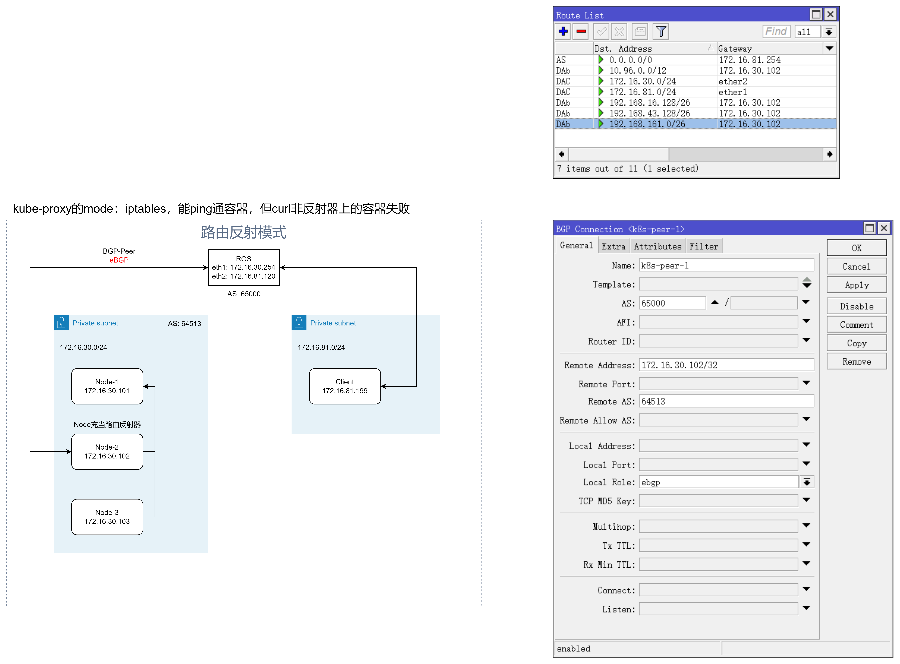
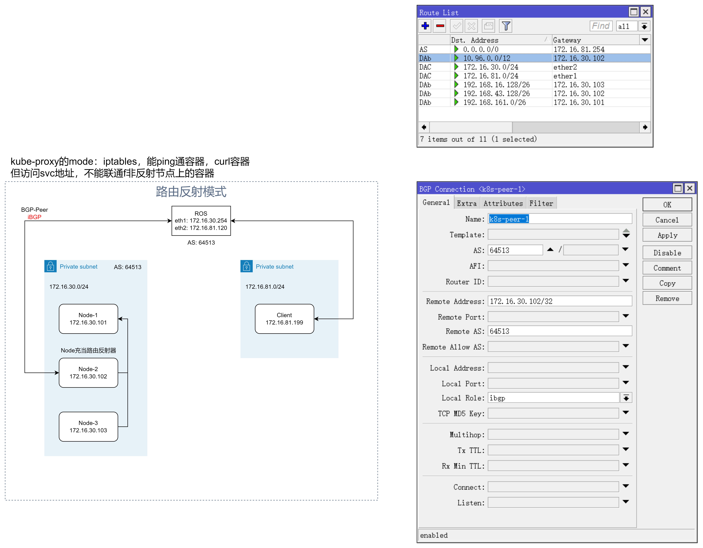

## calico的BGP配置
> 使用bgp路由，把外部网络与k8s内部网络打通。使用iBGP，建立BGP-Peer
- 基本信息:
  |IP|主机名|系统|角色|备注|
  |-|-|-|-|-|
  |172.16.30.101|ubuntu-1|Ubuntu 22.04 LTS|k8s-control||
  |172.16.30.102|ubuntu-2|Ubuntu 22.04 LTS|k8s-woker|路由反射节点，与路由器 or 交换机对等|
  |172.16.30.103|ubuntu-3|Ubuntu 22.04 LTS|k8s-woker||
  |172.16.81.199|client|Ubuntu 22.04 LTS|client||
  - 架构图-eBGP:
  - 架构图-iBGP:
  - k8s: 1.24.16
  - pods CIDR: 192.168.0.0/16
  - svc CIDR: 10.96.0.0/24
  - calico: v.3.26.1
  - kube-proxy: iptables
  - 外部网络CIDR: 172.16.81.0/24
- 路由器:
  |接口|IP|
  |-|-|
  |eth1|172.16.81.120/24|
  |eth2|172.16.30.254/24|
  - RouterOS-7.10.2
  - ASNumber: 64513
---
### RouterOS 路由配置
```bash
## 配置网卡IP地址
/ip/address/add address=172.16.81.120/24 interface=ether1
/ip/address/add address=172.16.30.254/24 interface=ether2
/ip/firewall/nat/add action=masquerade chain=srcnat

## 配置BGP路由
### ibgp模式
/routing/bgp/connection/add name=k8s-peer-1 remote.address=172.16.30.102 remote.as=64513 local.role=ibgp as=64513
### ebgp模式
/routing/bgp/connection/add name=k8s-peer-1 remote.address=172.16.30.102 remote.as=64513 local.role=ebgp as=65000

## 检查路由信息
/ip/route/print

## bgp信息检查
/routing/bgp/connection/print
```
### calico配置
1. 配置路由反射节点与路由器对等
   ```bash
   cat > peer-1.yaml <<EOF
   apiVersion: projectcalico.org/v3
   kind: BGPPeer
   metadata:
     name: rack1-tor
   spec:
     # 交换机or路由器的IP地址
     peerIP: 172.16.30.254
     # 交换机or路由器的AS号
     asNumber: 64513
     nodeSelector: rack == 'rack-1'
   EOF

   calicoctl apply -f peer-1.yaml

   kubectl label node ubuntu-2 rack=rack-1
   ```
2. 配置路由反射器
   ```bash
   kubectl annotate node ubuntu-2 projectcalico.org/RouteReflectorClusterID=244.0.0.1
   kubectl label node ubuntu-2 route-reflector=true

   cat > peer-2.yaml <<EOF
   kind: BGPPeer
   apiVersion: projectcalico.org/v3
   metadata:
     name: peer-with-route-reflectors
   spec:
     nodeSelector: all()
     peerSelector: route-reflector == 'true'
   EOF

   calicoctl apply -f peer-2.yaml
   ```
3. 配置BGP默认配置
   ```bash
   cat > bgp-config.yaml <<EOF
   apiVersion: projectcalico.org/v3
   kind: BGPConfiguration
   metadata:
     name: default
   spec:
     logSeverityScreen: Info
     nodeToNodeMeshEnabled: false
     asNumber: 64513
     serviceClusterIPs:
     - cidr: 10.96.0.0/24
   EOF

   calicoctl apply -f bgp-config.yaml
   ```
4. 检查calico的状态
   ```bash
   #ubuntu-1节点
   ./calicoctl-linux-amd64 node status
   Calico process is running.

   IPv4 BGP status
   +---------------+---------------+-------+----------+-------------+
   | PEER ADDRESS  |   PEER TYPE   | STATE |  SINCE   |    INFO     |
   +---------------+---------------+-------+----------+-------------+
   | 172.16.30.102 | node specific | up    | 09:36:15 | Established |
   +---------------+---------------+-------+----------+-------------+

   IPv6 BGP status
   No IPv6 peers found.

   #ubuntu-2节点
   # ubuntu-2节点已经与集群里的各个节点建立起连接
   # ubuntu-2节点已经与路由器节点建立起连接
   ./calicoctl-linux-amd64 node status
   Calico process is running.

   IPv4 BGP status
   +---------------+---------------+-------+----------+-------------+
   | PEER ADDRESS  |   PEER TYPE   | STATE |  SINCE   |    INFO     |
   +---------------+---------------+-------+----------+-------------+
   | 172.16.30.101 | node specific | up    | 09:36:19 | Established |
   | 172.16.30.103 | node specific | up    | 09:36:19 | Established |
   | 172.16.30.254 | node specific | up    | 05:27:01 | Established |
   +---------------+---------------+-------+----------+-------------+

   IPv6 BGP status
   No IPv6 peers found.
   ```

---
### 问题记录
1. 启用ipvs模式，访问svc地址，ipvs只能转发路由反射器本机上的容器，其他节点上的容器不能访问，因为数据包回包的时候没有经过路由反射器的节点，引起数据包被丢弃，导致tcp连接建立失败
```bash
# 第一步，client发送SYN包建立连接，k8s-node02节点上的pods接收到SYN包后，回复SYN/ACK包
           02-TCP-SYN/ACK
  +-----------------------------------------------------+
  v                                                     |
+--------+  01-TCP-SYN   +------------+  01-TCP-SYN   +------------+
| client | ------------> | k8s-node01 | ------------> | k8s-node02 |
+--------+               +------------+               +------------+image.png

# 第二步，由于k8s-node01没有接收到接收到k8s-node02回复的SYN/ACK包，因此重传SYN包
+--------+     +------------+  01-TCP-SYN   +------------+
| client | --> | k8s-node01 | ------------> | k8s-node02 |
+--------+     +------------+               +------------+

# 第三步，client接收到SYN/ACK包后，回复ACK包。但k8s-node01，没有收到SYN/ACK包，TCP连接的状态没有变更，因此对于client发送过来的的ACK进行丢弃
+--------+  03-TCP-ACK   +------------+     +------------+
| client | ------------> | k8s-node01 | --> | k8s-node02 |
+--------+               +------------+     +------------+

# 导致三次握手失败
```
2. 添加iptables -t nat -A POSTROUTING -j MASQUERADE后，导致/bin/calico-node -felix-live -bird-live 和 /bin/calico-node -felix-ready -bird-ready检查失败，引发容器重启，最终导致BGP连接断开
3. 添加了MASQUERADE后，所有流量会经过路由反射器。
4. iptables -t nat -A POSTROUTING ! -d 127.0.0.1 -j MASQUERADE
5. 当路由反射器挂掉后，等待一段时间后，各节点的路由信息回丢失，导致网络中断
---
### 参考信息
1. [干货收藏！Calico 路由反射模式权威指南](https://segmentfault.com/a/1190000040123110)
2. [H3C交换机配置BGP与IGP交互配置](https://www.h3c.com/cn/d_201802/1065961_30005_0.htm)
3. [Configure BGP peering](https://projectcalico.docs.tigera.io/networking/bgp)