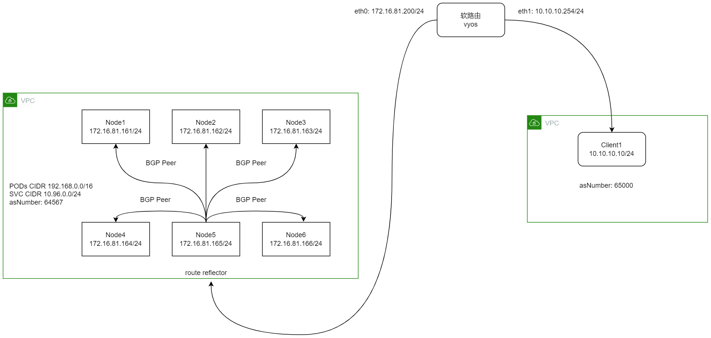

### calico
> 利用bgp路由，把外部网络与k8s内部网络打通
- 基本信息:
  - 架构图:
  - 系统: ubuntu 22.04 LTS
  - k8s: 1.22.12
  - node ip: 172.16.81.161 - 166
  - pod CIDR: 192.168.0.0/16
  - svc CIDR: 10.96.0.0/24
  - asNumber: 64567
  - calico: v3.23.3
  - kube-proxy: ipvs
  - 外部网路CIDR: 192.168.10.0/24
  - 路由器: RouterOS-6.48.6
    - eth0: 172.16.81.200/24
    - eth1: 10.10.10.254/24
    - asNumber: 65000
---
### ROS路由配置
```bash
## 配置网卡IP地址
/ip address add address=172.16.81.200 netmask=255.255.255.0 interface=ether1
/ip address add address=10.10.10.254 netmask=255.255.255.0 interface=ether2
/ip route add gateway=172.16.81.254

## 配置bgp路由
/routing bgp instance set default as=64567 redistribute-static=no
/routing bgp peer add name=peer-rr-k8s remote-address=10.10.10.254 remote-as=65000 address-familers=ip
/routing bgp network add network=10.10.10.0/24

## 检查路由信息
/ip route print

## bgp信息检查
/routing bgp network print
/routing bgp peer print
```
---
### calico配置
1. 添加默认的BGP配置
   - 关闭mesh模式
   - service的CIDR对外宣告
   - asNumber
   - 日志级别
   ```bash
   cat > bgp-config.yaml <<EOF
   apiVersion: projectcalico.org/v3
   kind: BGPConfiguration
   metadata:
     name: default
   spec:
     logSeverityScreen: Info
     nodeToNodeMeshEnabled: false
     asNumber: 63400
     serviceClusterIPs:
     - cidr: 10.96.0.0/24
   EOF

   calicoctl apply -f bgp-config.yaml
   ```
2. 配置每个节点的BGP对等体
   ```bash
   cat > bgppeer-1.yaml <<EOF
   apiVersion: projectcalico.org/v3
   kind: BGPPeer
   metadata:
     name: rack1-tor
   spec:
     # 交换机or路由器的IP地址
     peerIP: 172.16.81.200
     # 交换机or路由器的AS号
     asNumber: 65000
     nodeSelector: rack == 'rack-1'
   EOF
   
   calicoctl apply -f bgppeer-1.yaml

   kubectl label node my-node rack=rack-1
   ```
3. 配置节点作为路由反射器
   ```bash
   ## 配置集群ID，将node1配置为路由反射器
   calicoctl patch node my-node -p '{"spec": {"bgp": {"routeReflectorClusterID": "172.16.81.161"}}}'
   kubectl label node my-node route-reflector=true

   cat > bgppeer-rr.yaml <<EOF
   apiVersion: projectcalico.org/v3
   kind: BGPPeer
   metadata:
     name: rr1-to-node-peer              ## 给BGPPeer取一个名称，方便识别

   spec:
     nodeSelector: all()                           ## 通过节点选择器添加有rr-group == ‘rr1’标签的节点
     peerSelector: route-reflector == 'true'       ## 通过peer选择器添加有rr-id == ‘rr1’标签的路由反射器
   EOF

   calicoctl apply -f bgppeer-rr.yaml
   ```
4. 检查calico的状态
   ```bash
   calicoctl node status

   ## 以下为正确的状态
   Calico process is running.

   IPv4 BGP status
   +------------------------+---------------+-------+------------+-------------+
   |      PEER ADDRESS      |   PEER TYPE   | STATE |   SINCE    |    INFO     |
   +------------------------+---------------+-------+------------+-------------+
   | 172.16.81.162.port.178 | node specific | up    | 2022-07-27 | Established |
   | 172.16.81.163.port.178 | node specific | up    | 2022-07-27 | Established |
   | 172.16.81.164.port.178 | node specific | up    | 2022-07-27 | Established |
   | 172.16.81.165.port.178 | node specific | up    | 2022-07-27 | Established |
   | 172.16.81.166.port.178 | node specific | up    | 2022-07-27 | Established |
   | 172.16.81.200          | node specific | up    | 09:53:10   | Established |
   +------------------------+---------------+-------+------------+-------------+

   IPv6 BGP status
   No IPv6 peers found.
   
   ```
---
### 问题记录
1. 由于不清楚如何在VYOS中配置bgp advertisments，导致vyos无法将10.10.10.0/24网段中的客户请求，转发至k8s集群中。在路由器上，能够正常ping通k8s集群内部的pod。当前的处理方法为使用ROS代替vyos
---
### 参考信息
1. [干货收藏！Calico 路由反射模式权威指南](https://segmentfault.com/a/1190000040123110)
2. [H3C交换机配置BGP与IGP交互配置](https://www.h3c.com/cn/d_201802/1065961_30005_0.htm)
3. [Configure BGP peering](https://projectcalico.docs.tigera.io/networking/bgp)