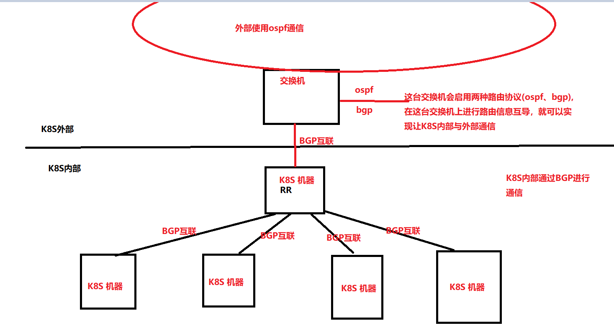

## calico 配置路由反射模式
### 信息
- k8s-contral:192.168.0.10
- k8s-worker:192.168.0.11 - 192.168.0.15.
  - 192.168.0.15作为k8s集群的路由反射节点（rr节点）
- ros节点:192.168.0.253
### 网络架构图
1. 关闭当前Calico Mesh模式
   ```bash
   cat << EOF | calicoctl create -f -
   apiVersion: projectcalico.org/v3
   kind: BGPConfiguration
   metadata:
     name: default
   spec:
     logSeverityScreen: Info
     nodeToNodeMeshEnabled: false
     asNumber: 63400
   EOF
   ```
2. 配置全局 BGP 对等体，peerIP是k8s集群中反射节点的IP
   ```bash
   cat << EOF | calicoctl create -f -
   apiVersion: projectcalico.org/v3
   kind: BGPPeer
   metadata:
     name: my-global-peer
   spec:
     peerIP: 192.168.0.15
     asNumber: 63400
   EOF
   ```
3. 配置每个节点的 BGP 对等体
   ```bash
   cat << EOF | calicoctl create -f -
   apiVersion: projectcalico.org/v3
   kind: BGPPeer
   metadata:
     name: rack1-tor
   spec:
     peerIP: 192.168.0.15
     asNumber: 63400
     nodeSelector: rack == 'rack-1'
   ```
4. 配置一个节点作为路由反射器
   ```bash
   # 配置节点的反射路由ID
   calicoctl patch node my-node -p '{"spec": {"bgp": {"routeReflectorClusterID": "244.0.0.1"}}}'
   
   # 给k8s节点打上标签
   kubectl label node my-node route-reflector=true
   
   cat << EOF | calicoctl create -f -
   kind: BGPPeer
   apiVersion: projectcalico.org/v3
   metadata:
     name: peer-with-route-reflectors
   spec:
     nodeSelector: all()
     peerSelector: route-reflector == 'true'
   EOF
   ```
5. 查看bgppeer
   ```bash
   NAME                         PEERIP           NODE               ASN
   my-global-peer               192.168.0.15   (global)           63400
   peer-with-route-reflectors                    all()              0
   rack1-tor                    192.168.0.15   rack == 'rack-1'   63400
   ```
6. 通过netstat命令查看节点间calico-node的连接，可以看到非RR节点只与RR节点建立连接，而RR节点与所有节点建立连接。
   ```bash
   netstat -natp | grep bird
   ```
7. 配置静态路由
   ```bash
   # 配置静态路由，联通svc
   ip route add 10.96.0.0/12 via 192.168.0.15
   # 配置静态路由，联通pod
   ip route add 192.168.0.0/16 via 192.168.0.15
   ```
8. Calico IPIP 模式的三个可选项：在默认情况下，默认的 ipPool 启用了 IPIP 封装(至少通过官方安装文档安装的 Calico 是这样)，并且封装模式为 Always；这也就意味着任何时候都会在原报文上封装新 IP 地址，在这种情况下将外部流量路由到 RR 节点，RR 节点再转发进行 IPIP 封装时，可能出现网络无法联通的情况(没仔细追查，网络渣，猜测是 Pod 那边得到的源 IP 不对导致的)；此时我们应当调整 IPIP 封装策略为 CrossSubnet
   - Always: 永远进行 IPIP 封装(默认)
   - CrossSubnet: 只在跨网段时才进行 IPIP 封装，适合有 Kubernetes 节点在其他网段的情况，属于中肯友好方案
   - Never: 从不进行 IPIP 封装，适合确认所有 Kubernetes 节点都在同一个网段下的情况
     ```bash
     
     导出 ipPool 配置
     
     calicoctl get ippool default-ipv4-ippool -o yaml > ippool.yaml
     修改 ipipMode 值为 CrossSubnet
     
     apiVersion: projectcalico.org/v3
     kind: IPPool
     metadata:
       creationTimestamp: 2019-06-17T13:55:44Z
       name: default-ipv4-ippool
       resourceVersion: "61858741"
       uid: 99a82055-9107-11e9-815b-b82a72dffa9f
     spec:
       blockSize: 26
       cidr: 10.20.0.0/16
       ipipMode: CrossSubnet
       natOutgoing: true
       nodeSelector: all()
     重新使用 calicoctl apply -f ippool.yaml 应用既可
     ```
---
### 与ROS路由器建立BGP Peer 对等连接
- 登录ROS的命令行，配置ROS的IP、路由器的AS number。
  ```bash
  /ip address add address=192.168.0.253 netmask=255.255.255.0 interface=ether1
  /routing bgp instance set default as=63400 redistribute-static=no
  /routing bgp peer add remote-address=192.168.0.15 remote-as=63400 address-familers=ip
  # 查看bgp的对等连接的状态，正常状态下，此时bgp的状态为open send
  /routing bgp peer print
  /routing bgp peer print status
  ```
- 在calico中添加对等连接，正常状态下，此时bgp的状态为established，且ros中能学习到路由规则
  ```bash
  cat << EOF | calicoctl create -f -
  apiVersion: projectcalico.org/v3
  kind: BGPPeer
  metadata:
    name: rr1-to-ros-peer
  spec:
    nodeSelector: rr-id == 'rr1'
    peerIP: 192.168.0.253
    asNumber: 63400
  EOF

  kubectl label nodes node1 rr-id=rr1

  # 在ros中检查路由规则
  /routing bgp peer print status
  /ip route print detail
  /ip route print where bgp
  ```
---
- 问题：
  - 配置静态路由后。在k8s外部使用dig进行dns解析出现以下报错。由于dns的回包地址变更导致这个错误出现。解决方法没有。
    ```bash
    dig @10.96.0.10 www.qq.com +short
    ;; reply from unexpected source: 192.168.36.207#53, expected 10.96.0.10#53
    ```
  - 在阿里云上启用服务器安全组，需要在安全组中放通pods的IP段。当关闭IPIP模式后，数据包的目的地址回变为pod的IP地址，也需要在安全组中放通pods的IP段。
---
### 参考信息
- [OpenShift支持Calico BGP 路由反射（RR）模式](https://www.jianshu.com/p/1ea22c6d26fd)
- [H3C交换机配置OSPF导入外部路由](https://www.h3c.com/cn/d_201802/1065959_30005_0.htm#_Toc505352341)
- [H3C交换机配置BGP与IGP交互配置](https://www.h3c.com/cn/d_201802/1065961_30005_0.htm#_Toc505352832)
- [Kubernetes网络组件之Calico策略实践(BGP、RR、IPIP)](https://blog.51cto.com/14143894/2463392?source=drh)
- [calico官网配置文档](https://docs.projectcalico.org/networking/bgp)
- [calico官网配置BGP路由文档](https://docs.projectcalico.org/reference/resources/bgpconfig)
- [Kubernetes网络之Calico](https://www.cnblogs.com/ssgeek/p/13194687.html)
- [干货收藏！Calico 路由反射模式权威指南](https://mp.weixin.qq.com/s/hLiI9fsPQ7w4PS2ALff09g)