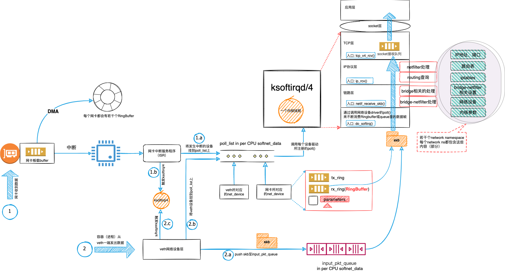

## k8s 网络
1. 基础和基石
1.1 TCP/IP协议栈和网络栈
K8s“扁平网络”的三种典型实现方式是：Overlay、主机间路由（host-gw）以及Underlay。它们都会在容器内虚拟一张网卡，取决于实现方式的不同，这张虚拟网卡既可能是veth类型的，也可能直接对物理网卡的虚拟。

1.2  虚拟网卡数据接收流程
二哥在文章《看图写话：聊聊veth数据流》和《高清大图描绘辛苦的ksoftirqd》中结合图1，描述了网路包从veth一端流出到流入另一端过程中所涉及到的数据流以及在这个过程中内核线程ksoftirqd起到的至关重要的作用。这张图也适用普通虚拟网卡。
图1有一些关键的地方，我把它们列在这里，希望你看完后可以不自觉地拍下大腿，轻呼一声：哦，原来如此。
为了便于对比，它包含了两种类型的网络设备：一个物理网卡和veth虚拟网卡。数据流分为两条线路：线路1和线路2。
线路1从物理网卡的数据接收开始，涉及到中断处理流程和DMA。这一步的处理结果是网络包被放进了与每个网卡相关的queue（RingBuffer）里面。
线路2从容器内的进程在veth一端发送数据开始，它相对简单很多，主要是单纯的软件调用，没有硬件的介入。这一步的处理结果是skb被放入到了input_pkt_queue里。
无论是线路1还是线路2，它们都需要唤起ksoftirqd以便来处理skb，并提前将相应的网卡挂到per CPU的poll_list上。我们可以将poll_list想象成晾晒香肠的架子，而每个网络设备则如同香肠一样挂到架子上面等待ksoftirqd处理。
ksoftirqd扛起了网络包处理的重担。它从pull_list里找到要处理的网卡并从该网卡的queue里面拿到skb，然后沿着网络设备子系统 -> IP协议层 -> TCP层一路调用内核里面的函数来分析和处理这个skb，最终将其放置到位于TCP层的socket接收队列里。
这个处理过程包括iptables的处理、路由查询、TCP协议处理等各种费时费力的工作。如图1所示，这里的iptables、路由查询等数据部分与每个network namespace相关，宿主机OS上会有若干个network ns，但TCP/IP协议栈作为代码部分却是大家共享的。

---
### 参考连接
- [多图汇总梳理VPC与三种K8s网络模型](https://mp.weixin.qq.com/s/W04uff4sHrPM_VtjzHPoJA)
- [当vpc遇到K8s overlay](https://mp.weixin.qq.com/s?__biz=Mzk0ODI3NDQ0NQ==&mid=2247483952&idx=1&sn=46f8de80e7377cb9b5b59bf7cda360c1&chksm=c36b5652f41cdf44c003b51e902151fd3834cebbb477b06a31e2b4c8f8d845619067a5f82003&scene=21#wechat_redirect)
- [看图写话：聊聊veth数据流](https://mp.weixin.qq.com/s/hJRPTvgvRT_YZK__5VFFtg)