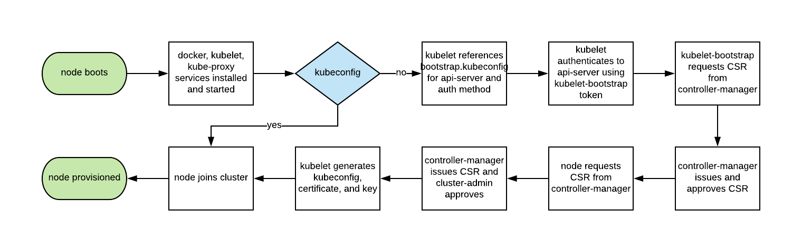

# kubernetes的证书
使用kubeadmin创建的证书只有一年有效期，检查所有证书的过期时间： 
* 使用kubeadmin创建集群的检查方法：kubeadm alpha certs check-expiration
* 其他集群的检查方法：
  ```bash
  CERT_DIR=${CERT_DIR:-/etc/kubernetes/pki}
  for i in $(find $CERT_DIR -name '*.crt' -o -name '*.pem');
  do
      echo $i
      openssl x509 -enddate -in $i -noout
  done

  for f in $(ls /etc/kubernetes/{admin,controller-manager,scheduler}.conf);
  do
      echo $f
      kubectl --kubeconfig $f config view --raw -o jsonpath='{range .users[*]}{.user.client-certificate-data}{end}' | base64 -d | openssl x509 -enddate -noout
  done
  ```
## master节点
* 证书存储的位置/etc/kubernetes/pki/
* etcd使用证书的存储位置/etc/kubernetes/pki/etcd
* 使用kubeadm更新所有证书：kubeadm alpha certs renew all

## 使用启动引导令牌（Bootstrap Tokens）认证
* TLS启动过程
  
## kubelet自动生成的证书
会在/var/lib/kubelet/pki/生成
  * kubelet-client-current.pem：这是一个软连接文件，当 kubelet 配置了--feature-gates=RotateKubeletClientCertificate=true (1.17版本上的默认值为true)选项后，会在证书有效期的 70%~90% 的时间内发起续期请求，请求被批准后会生成一个 kubelet-client-时间戳.pemkubelet-client-current.pem 文件则始终软连接到最新的真实证书文件，除首次启动外，kubelet 一直会使这个证书同 apiserver 通讯
  * kublete-server-current.pem：同样是一个软连接文件，当 kubelet 配置了--feature-gates=RotateKubeletServerCertificate=true (1.17版本上的默认值为true)选项后，会在证书有效期的 70%~90% 的时间内发起续期请求，请求被批准后会生成一个 kubelet-server-时间戳.pemkubelet-server-current.pem 文件则始终软连接到最新的真实证书文件，该文件将会一直被用于 kubelet10250 api 端口鉴权
  * kubelet.key / kubelet.crt：该文件在 kubelet 完成 TLS bootstrapping 后并且没有配置--feature-gates=RotateKubeletServerCertificate=true 时才会生成；这种情况下该文件为一个独立于apiserver CA 的自签 CA 证书，有效期为 1 年；被用作 kubelet 10250 api 端口
  * kubelet.key
## 生成启动引导令牌与bootstrap-kubeconfig文件
每个合法的令牌背后对应着 kube-system 命名空间中的bootstrap-token-<token-id> Secret 对象。
* 使用工具生成token：kubeadm token create --ttl 2h
* 手动生成
  ```bash
  # 生成token-id、token-secret，注意token定义有expiration字段，说明token是有有效时间
  TOKENID=`head -c 6 /dev/urandom | md5sum | head -c 6`
  TOKENSECRET=`head -c 16 /dev/urandom | md5sum | head -c 16`
  TIME=`date -d "+6 hour" +%Y-%m-%dT%H:00:00%:z`
  KUBE_APISERVER="https://192.168.1.1:6443"
  
  cat <<EOF | kubectl apply -f -
  apiVersion: v1
  kind: Secret
  metadata:
    name: bootstrap-token-${TOKENID}
    namespace: kube-system
  type: bootstrap.kubernetes.io/token
  stringData:
    description: "The bootstrap token for testing."
    token-id: ${TOKENID}
    token-secret: ${TOKENSECRET}
    expiration: ${TIME}
    usage-bootstrap-authentication: "true"
    usage-bootstrap-signing: "true"
    auth-extra-groups: system:bootstrappers:kubeadm:default-node-token
  EOF

  BOOTSTRAP_TOKEN="$TOKENID.$TOKENSECRET"
  cd /etc/kubernetes
  
  # 设置集群参数
  kubectl config set-cluster kubernetes \
  --certificate-authority=/etc/kubernetes/pki/ca.crt \
  --embed-certs=true \
  --server=${KUBE_APISERVER} \
  --kubeconfig=bootstrap.kubeconfig
  
  # 设置客户端认证参数
  kubectl config set-credentials kubelet-bootstrap \
  --token=${BOOTSTRAP_TOKEN} \
  --kubeconfig=bootstrap.kubeconfig
  
  # 设置上下文参数
  kubectl config set-context default \
  --cluster=kubernetes \
  --user=kubelet-bootstrap \
  --kubeconfig=bootstrap.kubeconfig
  
  # 设置默认上下文
  kubectl config use-context default --kubeconfig=bootstrap.kubeconfig
  
  mv bootstrap.kubeconfig /etc/kubernetes/bootstrap-kubelet.conf
  ```
  ## 参考信息
* [Kubernetes 集群 TLS 证书管理最佳实践](https://zhuanlan.zhihu.com/p/133828552)
* [api信息查询](https://kubernetes.io/docs/reference/kubernetes-api/api-index/)
* [官方bootstrap的文档](https://kubernetes.io/zh/docs/reference/access-authn-authz/bootstrap-tokens/)
* [官方1.18版本的证书更新](https://v1-18.docs.kubernetes.io/docs/tasks/administer-cluster/kubeadm/kubeadm-certs/)