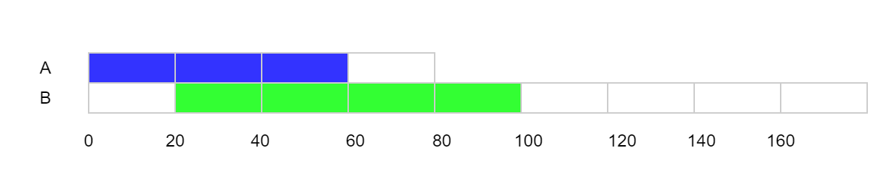

### CPU 限流
> k8s 使用 CFS（Completely Fair Scheduler，完全公平调度）限制负载的 CPU 使用率，CFS 本身的机制比较复杂[1]，但是 k8s 的文档中给了一个简明的解释[2]，要点如下：
  - CPU 使用量的计量周期为 100ms；
  - CPU limit 决定每计量周期（100ms）内容器可以使用的 CPU 时间的上限；
  - 本周期内若容器的 CPU 时间用量达到上限，CPU 限流开始，容器只能在下个周期继续执行；
  - 1 CPU = 100ms CPU 时间每计量周期，以此类推，0.2 CPU = 20ms CPU 时间每计量周期，2.5 CPU = 250ms CPU 时间每计量周期；
  - 如果程序用了多个核，CPU 时间会累加统计。

> 举个例子，假设一个 API 服务在响应请求时需要使用 A, B 两个线程（2 个核），分别使用 60ms 和 80ms，其中 B 线程晚触发 20ms，我们看到 API 服务在 100ms 后可给出响应：
  - 没有 CPU 限制的情况，响应时间为 100ms
  - 

> 如果 CPU limit 被设为 1 核，即每 100ms 内最多使用 100ms CPU 时间，API 服务的线程 B 会受到一次限流（灰色部分），服务在 140ms 后响应：
  - 
  - CPU limit = 1，响应时间为140ms

> 如果 CPU limit 被设为 0.6 核，即每 100ms 内最多使用 60ms CPU 时间，API 服务的线程 A 会受到一次限流（灰色部分），线程 B 受到两次限流，服务在 220ms 后响应：
  - 
  - CPU limit = 0.6，响应时间为220ms

> 注意，即使此时 CPU 没有其他的工作要做，限流一样会执行，这是个死板不通融的机制。

> 这是一个比较夸张的例子，一般的 API 服务是 IO 密集型的，CPU 时间使用量没那么大（你在跑模型推理？当我没说），但还是可以看到，限流会实打实地延伸 API 服务的延时。因此，对于延时敏感的服务，我们都应该尽量避免触发 k8s 的限流机制。

> 下面这张图是我工作中一个 API 服务在 pod 级别的 CPU 使用率和 CPU 限流比率（CPU Throttling），我们看到，CPU 限流的情况在一天内的大部分时候都存在，限流比例在 10%上下浮动，这意味着服务的工作没能全速完成，在速度上打了 9 折。值得一提，这时 pod 所在节点仍然有富余的 CPU 资源，节点的整体 CPU 使用率没有超过 50%.
---
### 引用连接
1. [崩溃，K8s 使用 CPU Limit 后，服务响应变成龟速](https://mp.weixin.qq.com/s/QYJycJCaxB42xdEo3qHHHA)