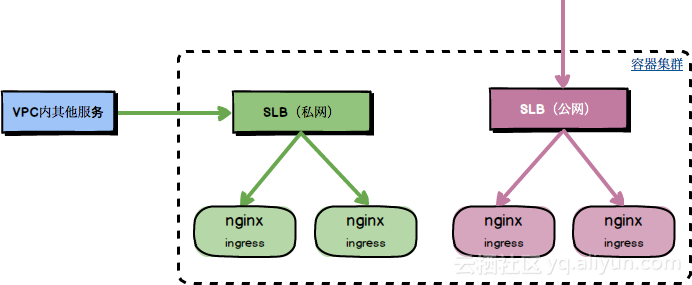

## Kubernes集群中使用多个Ingress Controller
* 场景说明
  * 集群内有部分公网服务需要通过公网Ingress方式来对外暴露提供访问，但是又有部分内网服务仅仅只希望对同VPC内非Kubernetes集群内的服务提供访问，而又不允许能被公网访问到，对此我们完全可以通过部署两套独立的Nginx Ingress Controller服务，其前端绑定不同网络类型的SLB实例来满足这类需求场景
  
  * 环境设定
    * 使用Azure托管的Kubernetes服务：AKS
    * Kubernetes Server版本：v1.12.8
    * Kubernetes Client版本: v1.15.3
    * helm版本: v2.14.2
## 创建LB入口
* 使用helm生成yaml文件
  ```bash
  git clone https://github.com/helm/charts.git
  cd charts/stable/nginx-ingress
  
  #name的命名为全小写
  helm template . --name cosmic-cuttlefish > external-lb.yaml
  helm template . --name disco-dingo > internal-lb.yaml
  ```
* 修改yaml文件
  ```bash
  #修改internal-lb文件中Deployment的配置，修改args的参数
  sed -i 's|ingress-class=nginx|ingress-class=nginx-internal|g' internal-lb.yaml
  sed -i 's|election-id=ingress-controller-leader|election-id=ingress-controller-leader-internal|g' internal-lb.yaml

  #修改internal-lb文件中Service-LoadBalancer的配置，增加annotations。
  apiVersion: v1
  kind: Service
  metadata:
    name: my-service
    annotations:
      service.beta.kubernetes.io/azure-load-balancer-internal: "true"
  spec:
    selector:
      app: MyApp
    ports:
      - protocol: TCP
        port: 80
        targetPort: 9376
    type: LoadBalancer
  ```
* 在Kubernetes创建LB入口
  ```bash
  kubectl -n ingress-basic create -f external-lb.yaml -f internal-lb.yaml
  ```
* 访问测试
    * 创建nginx应用验证
      ```bash
      apiVersion: extensions/v1beta1
      kind: Deployment
      metadata:
        name: nginx
      spec:
        replicas: 1
        selector:
          matchLabels:
            run: nginx
        template:
          metadata:
            labels:
              run: nginx
          spec:
            containers:
            - image: nginx
              imagePullPolicy: Always
              name: nginx
              ports:
              - containerPort: 80
                protocol: TCP
            restartPolicy: Always
      ---
      apiVersion: v1
      kind: Service
      metadata:
        name: nginx
      spec:
        ports:
        - port: 80
          protocol: TCP
          targetPort: 80
        selector:
          run: nginx
        sessionAffinity: None
        type: NodePort
      ```
    * 通过Ingress来对外暴露提供服务访问
      ```bash
      apiVersion: extensions/v1beta1
      kind: Ingress
      metadata:
        name: nginx
        annotations:
          # 注意这里要设置为您前面配置的 INGRESS_CLASS
          kubernetes.io/ingress.class: "nginx-internal"
      spec:
        rules:
        - host: foo.bar.com
          http:
            paths:
            - path: /
              backend:
                serviceName: nginx
                servicePort: 80
      ```
    * 获取IP
      ```bash
      kubectl -n ingress-basic get svc
      NAME          TYPE           CLUSTER-IP    EXTERNAL-IP    PORT(S)                      AGE
      external-lb   LoadBalancer   172.19.7.30   47.95.97.115   80:31429/TCP,443:32553/TCP   2d
      internal-lb   LoadBalancer   172.19.6.227  192.168.0.12   80:30969/TCP,443:31325/TCP   39m
      ```
    * curl访问
      ```bash
      #通过集群默认的 Nginx Ingress Controller 服务访问该应用，预期返回404
      curl -H "Host: foo.bar.com" http://47.95.97.115
      default backend - 404

      # 通过新部署的 Nginx Ingress Controller 服务访问该应用，预期返回nginx页面
      curl -H "Host: foo.bar.com" http://192.168.0.12
      ```
---
参考资料
* [阿里云文档-1](https://yq.aliyun.com/articles/645856)
* [阿里云文档-2](https://yq.aliyun.com/articles/603655)
* [文档-1](https://kubernetes.github.io/ingress-nginx/user-guide/multiple-ingress/)
* 