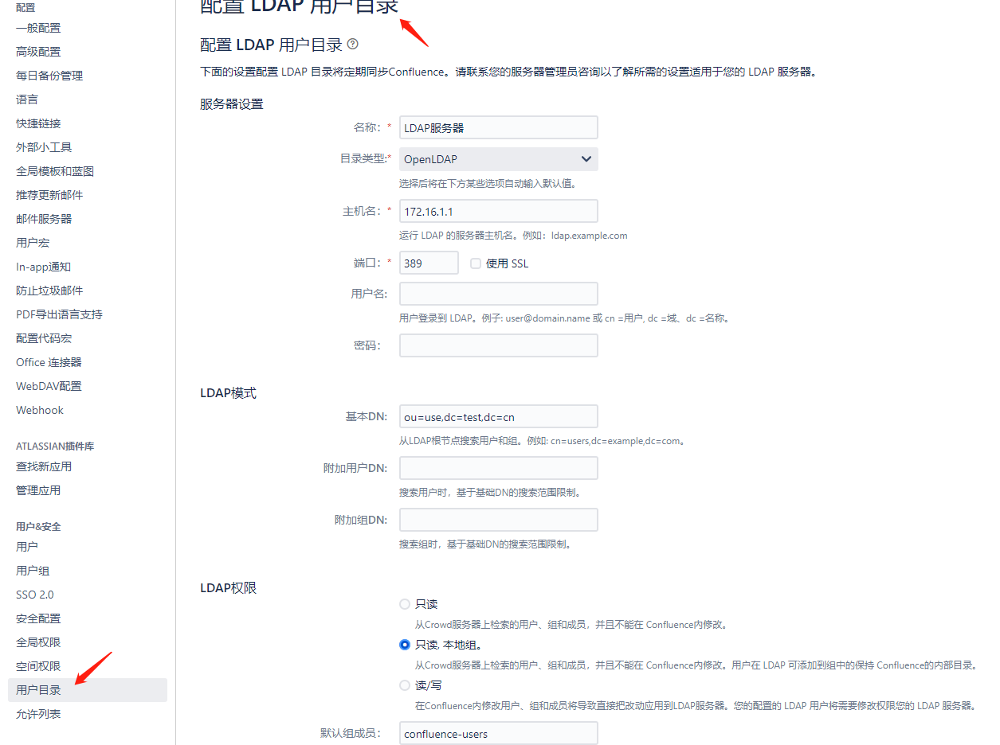
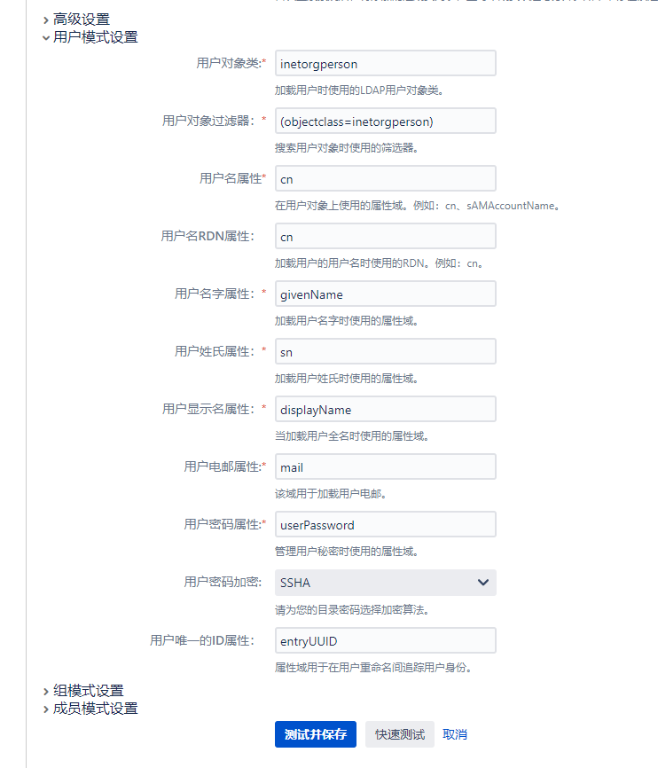

## Confluence 的wiki服务安装
- wiki的版本为: 7.13.0
- 数据库: PostgreSQL 9.6。使用docker启动
### 使用docker运行PostgreSQL数据库。并创建数据库与用户
```bash
cat > pg.yaml <<EOF
version: "3.9"
services:
  postgres:
    image: postgres:9.6.23-alpine3.14
    container_name: confluence-database
    restart: always
    ports:
      - 5432:5432
    volumes:
      - /data/pg-data:/var/lib/postgresql/data
    environment:
      POSTGRES_PASSWORD: mysecretpassword
EOF

docker-compose -f pg.yaml up -d
```
### 在官网上下载安装包
- [官网下载地址](https://www.atlassian.com/zh/software/confluence/download-archives)
- 在服务器上下载安装包
  ```bash
  chmod a+x atlassian-confluence-7.13.0-x64.bin
  bash atlassian-confluence-7.13.0-x64.bin
  按照提示完成安装
  ```
- 国际惯例：本文档只做个人学习研究之用
  - 破解
    - 破解文件: 在服务器上下载文件: /opt/atlassian/confluence/confluence/WEB-INF/lib/atlassian-extras-decoder-v2-3.4.1.jar
    - atlassian-extras-2.4.jar
    - 运行破解工具confluence_keygen,对atlassian-extras-2.4.jar文件破解
    - 完成后将破解文件上传回原位置，并重启confluence
  - 使用浏览器打开IP:8090访问confluence
  - 设置语言中文 - 产品安装 - 输入授权码
  - 将服务器ID，粘贴至破解工具中，计算出授权码
### 配置LDAP
- 点开 管理-用户管理-用户目录-添加目录
- 目录类型：OpenLDAP。填写LDAP服务器信息
- 配置用户模式设置。根据LDAP中，用户的条目属性进行调整
  
  
---
### 参考连接
[confluence安装](https://blog.51cto.com/m51cto/2131964)