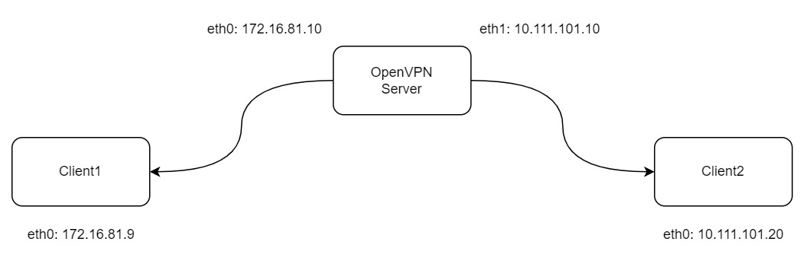

## OpenVPN部署
### 基本情况
- 架构图

- OpenVPN Server:
  - OS: CentOS7.9.2009
  - eth0: 172.16.81.10
  - eth1: 10.111.101.10
- Client1:
  - OS: CentOS7.9.2009
  - eth0: 172.16.81.9
- Client2:
  - OS: Ubuntu-22.04
  - eth0: 10.111.101.20
---
### OpenVPN Server配置
```bash
# OpenVPN在epel源中，因此需要安装EPEL源
wget -O /etc/yum.repos.d/epel.repo https://mirrors.aliyun.com/repo/epel-7.repo
yum cleanall
yum makecache

# 安装openvpn、证书生成工具
yum install -y openvpn easy-rsa
mkdir -p /etc/openvpn/easy-rsa
cd /etc/openvpn/easy-rsa
cp /usr/share/doc/easy-rsa-3.0.8/vars.example /etc/openvpn/easy-rsa/vars

# 生成证书，服务端x1，客户端x1，dh，ta.key
/usr/share/easy-rsa/easyrsa init-pki
/usr/share/easy-rsa/easyrsa build-ca nopass
/usr/share/easy-rsa/easyrsa build-server-full server nopass
/usr/share/easy-rsa/easyrsa build-client-full client1 nopass

/usr/share/easy-rsa/easyrsa gen-dh
openvpn --genkey --secret ta.key

## 整理服务端证书
cp -a pki/ca.crt /etc/openvpn/server/
cp -a pki/private/server.key /etc/openvpn/server/
cp -a pki/issued/server.crt /etc/openvpn/server/
cp -a pki/dh.pem /etc/openvpn/server/
cp -a ta.key /etc/openvpn/server/

## 客户端证书
cp -a pki/private/client1.key /etc/openvpn/client/
cp -a pki/issued/client1.crt /etc/openvpn/client/

## 创建服务端配置文件
cat > /etc/openvpn/server/server.conf <<EOF
local 172.16.81.10
port 1194
proto udp
dev tun

# 证书
ca ca.crt
cert server.crt
key server.key
dh dh.pem

# tls认证
tls-auth ta.key 0

# 该网段为 openVPN 虚拟网卡网段，不能和内网网段冲突即可。
server 10.8.0.0 255.255.255.0
ifconfig-pool-persist ipp.txt

# 给客户端推送自定义路由
push "route 10.111.101.0 255.255.255.0"

# 向客户端推送DNS配置
push "dhcp-option DNS 114.114.114.114"
push "dhcp-option DNS 8.8.8.8"

keepalive 10 120

# 运行用户和用户组
user nobody
group nobody

cipher AES-256-CBC
persist-key
persist-tun

# 日志
status openvpn-status.log
log openvpn.log
log-append openvpn.log
verb 3
explicit-exit-notify 1

max-clients 1000
duplicate-cn
client-to-client
username-as-common-name
script-security 3
EOF

iptables -t nat -A POSTROUTING -s 10.8.0.0/24 -j MASQUERADE
echo "1" > /proc/sys/net/ipv4/ip_forward

openvpn --config /etc/openvpn/server/server.conf

# 使用systemctl启动
systemctl enable openvpn-server@server
```
---
### OpenVPN Client配置
- 从服务端上，把client1.crt、client1.key、ta.key、dh.pem复制到客户端上（/etc/openvpn/client/）。
  ```bash
  cat > /etc/openvpn/client/client.conf <<EOF
  client
  dev tun
  proto udp
  remote 172.16.81.10 1194
  resolv-retry infinite
  nobind
  persist-key
  persist-tun
  ca ca.crt
  cert client1.crt
  key client1.key
  remote-cert-tls server
  tls-auth ta.key 1
  cipher AES-256-CBC
  verb 3
  EOF

  openvpn --config /etc/openvpn/client.conf
  ```
- 在客户端中，导入ca.crt、cert、key、tls-auth的证书文件
  ```bash
  cat > /etc/openvpn/client/client.conf <<EOF
  client
  dev tun
  proto udp
  remote 172.16.81.10 1194
  resolv-retry infinite
  nobind
  persist-key
  persist-tun
  #ca ca.crt
  #cert client1.crt
  #key client1.key
  #tls-auth ta.key 1

  remote-cert-tls server
  cipher AES-256-CBC
  verb 3

  <ca>
  ca.crt 文件内容
  </ca>
  <cert>
  client.crt 文件内容
  </cert>
  <key>
  client.key 文件内容
  </key>
  key-direction 1
  <tls-auth>
  ta.key 文件内容
  </tls-auth>
  EOF

  openvpn --config /etc/openvpn/client.conf
  ```
---
### OpenVPN接入OpenLDAP
```bash
# 安装ldap插件
yum install -y openvpn-auth-ldap

mkdir -p /etc/openvpn/auth

cat >> /etc/openvpn/server/server.conf <<EOF
plugin /usr/lib64/openvpn/plugin/lib/openvpn-auth-ldap.so /etc/openvpn/auth/ldap.conf
EOF

# 修改ldap.conf配置文件
cp /etc/openvpn/auth/ldap.conf /etc/openvpn/auth/ldap.conf.bak
cat > /etc/openvpn/auth/ldap.conf <<EOF
<LDAP>
        URL             ldap://172.16.81.10
        BindDN          cn=admin,dc=example,dc=com
        Password        123456
        Timeout         15
        TLSEnable       No
        FollowReferrals yes
</LDAP>

<Authorization>
        BaseDN          "ou=devel,ou=tech,dc=example,dc=com"
        SearchFilter    "(uid=%u)"
        RequireGroup    false
</Authorization>
EOF

systemctl restart openvpn
```
---
### 临时记录
```bash
openvpn with openldap

# install
apt install -y openvpn easy-rsa

# server / client create crt with easy-rsa
/usr/share/easy-rsa/easyrsa init-pki
/usr/share/easy-rsa/easyrsa build-ca nopass
/usr/share/easy-rsa/easyrsa build-server-full server nopass
/usr/share/easy-rsa/easyrsa build-server-full client1 nopass

/usr/share/easy-rsa/easyrsa gen-dh
openvpn --genkey --secret ta.key

## 整理服务端证书
cp -a pki/ca.crt /etc/openvpn/server/
cp -a pki/private/server.key /etc/openvpn/server/
cp -a pki/issued/server.crt /etc/openvpn/server/
cp -a pki/dh.pem /etc/openvpn/server/
cp -a ta.key /etc/openvpn/server/

## 客户端证书
cp -a pki/private/client1.key /etc/openvpn/client/
cp -a pki/issued/client1.crt /etc/openvpn/client/

## 配置openvpn的配置文件
cp /usr/share/doc/openvpn/examples/sample-config-files/server.conf /etc/openvpn/server/


mkdir -p /etc/openvpn/cert
cd /etc/openvpn/cert

openssl genrsa -out ca.key 2048
openssl req -new -key ca.key -out ca.csr
openssl x509 -req -in ca.csr -out ca.crt -signkey ca.key -days 3650

openssl genrsa -out server.key 2048
openssl req -new -key server.key -out server.csr
openssl x509 -req -in server.csr -out server.cert  -CA ca.crt -CAkey ca.key -CAcreateserial  -days 3650

openssl genrsa -out client.key 2048
openssl req -new -key client.key -out client.csr
openssl x509 -req -in client.csr -out client.cert  -CA ca.crt -CAkey ca.key -CAcreateserial  -days 3650

openssl dhparam -dsaparam -out dh2048.pem 2048
openvpn --genkey tls-auth ta.key

cp /usr/share/doc/openvpn/examples/sample-config-files/server.conf server.conf

openvpn --config /etc/openvpn/server/server.conf
```


```bash

systemctl enable openvpn-server@server
```
---
### 问题记录
- 在服务端上遇到tls认证出错，大概率为证书问题，使用easy-rsa重新生成证书
---
### 参考链接
- [OpenVPN服务部署](https://developer.aliyun.com/article/829724#slide-6)
- [easyrsa使用指南](https://github.com/OpenVPN/easy-rsa/blob/master/README.quickstart.md)
- [如何在 Ubuntu 20.04 上设置和配置 OpenVPN 服务器](https://www.gingerdoc.com/tutorials/how-to-set-up-and-configure-an-openvpn-server-on-ubuntu-20-04)