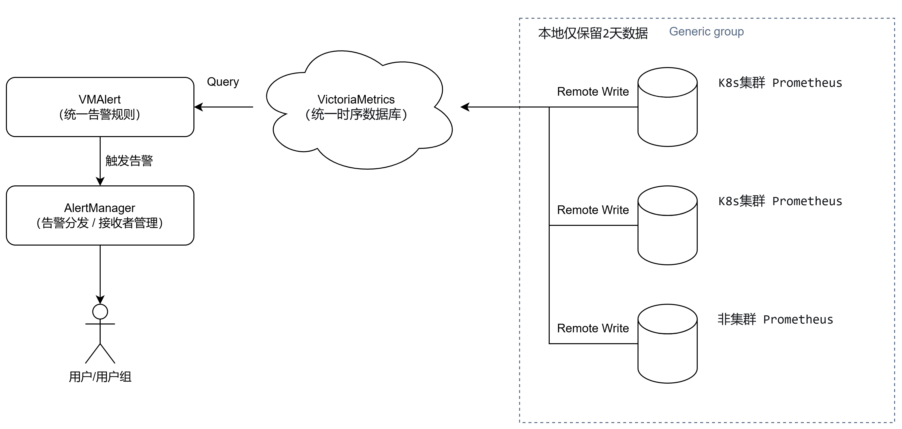

## VictoriaMetrics 的使用
> VM 分为单节点和集群两个方案，根据业务需求选择即可。单节点版直接运行一个二进制文件既，官方建议采集数据点(data points)低于 100w/s，推荐 VM 单节点版，简单好维护，但不支持告警。集群版支持数据水平拆分。下图是 VictoriaMetrics 集群版官方的架构图。

### 使用VictoriaMetrics聚合监控数据
- 架构图如下
- 软件版本
  - victoriaMetrics：1.144
  - vmalert：1.144
  - Prometheus：
    - 非集群：2.37.5
    - 集群：3.5.0

### 配置
1. 对k8s集群的Prometheus配置
   ```bash
   # 修改node_exporter配置，将instance的内容。由主机名修改为IP地址；
   kubectl edit servicemonitor -n monitoring  node-exporter
   
   apiVersion: monitoring.coreos.com/v1
   kind: ServiceMonitor
   metadata:
     labels:
       app.kubernetes.io/component: exporter
       app.kubernetes.io/name: node-exporter
       app.kubernetes.io/part-of: kube-prometheus
       app.kubernetes.io/version: 1.9.1
     name: node-exporter
     namespace: monitoring
   spec:
     endpoints:
     - bearerTokenFile: /var/run/secrets/kubernetes.io/serviceaccount/token
       interval: 15s
       port: https
       relabelings:
       - action: replace
         regex: (.*)
         replacement: $1
         sourceLabels:
         # 修改内容
         - __meta_kubernetes_pod_host_ip
         targetLabel: instance
       scheme: https
       tlsConfig:
         insecureSkipVerify: true
     jobLabel: app.kubernetes.io/name
     selector:
       matchLabels:
         app.kubernetes.io/component: exporter
         app.kubernetes.io/name: node-exporter
         app.kubernetes.io/part-of: kube-prometheus

   # 修改Prometheus的配置，添加remote write配置，添加标签：
   kubectl edit prometheus -n monitoring k8s
   apiVersion: monitoring.coreos.com/v1
   kind: Prometheus
   metadata:
     labels:
       app.kubernetes.io/component: prometheus
       app.kubernetes.io/instance: k8s
       app.kubernetes.io/name: prometheus
       app.kubernetes.io/part-of: kube-prometheus
       app.kubernetes.io/version: 3.5.0
     name: k8s
     namespace: monitoring
   spec:
     alerting:
       alertmanagers:
       - apiVersion: v2
         name: alertmanager-main
         namespace: monitoring
         port: web
     evaluationInterval: 30s
     # 修改内容，添加标签
     externalLabels:
       cluster: stage01-shenzhen
     image: docker.io/tools/prometheus:v3.5.0
     imagePullSecrets:
     - name: regcred
     nodeSelector:
       kubernetes.io/os: linux
     podMetadata:
       labels:
         app.kubernetes.io/component: prometheus
         app.kubernetes.io/instance: k8s
         app.kubernetes.io/name: prometheus
         app.kubernetes.io/part-of: kube-prometheus
         app.kubernetes.io/version: 3.5.0
     portName: web
     # 添加remoteWrite，为VM的地址，因为Prometheus的副本有2个，因此需要删除prometheus_replica的标签，让vm自动过滤重复的数据
     remoteWrite:
     - url: http://192.168.1.44:8428/api/v1/write
       writeRelabelConfigs:
       - action: labeldrop
         regex: prometheus_replica
     replicas: 2
     resources:
       requests:
         memory: 400Mi
     scrapeInterval: 30s
     securityContext:
       fsGroup: 2000
       runAsNonRoot: true
       runAsUser: 1000
     serviceAccountName: prometheus-k8s
     version: 3.5.0
    ```
2. 对非集群的Prometheus配置
```bash
```
3. 配置VictorMetrics配置
   1. 安装VM
      ```bash
      useradd -M -s /sbin/nologin victormetrics
      mkdir -p /data/victoria-metrics/{bin,victoria-metrics-data, rule.d}

      wget https://github.com/VictoriaMetrics/VictoriaMetrics/releases/download/v1.144.0/victoria-metrics-linux-amd64-v1.144.0.tar.gz
      tar xf victoria-metrics-linux-amd64-v1.144.0.tar.gz
      mv victoria-metrics-prod /data/victoria-metrics/bin/.
      ```
   2. 在systemd中配置vm
      ```bash
      cat > /etc/systemd/system/victoriaMetrics.service <<'EOF'
      [Unit]
      Description=VictoriaMetrics

      [Service]
      Type=simple
      User=victormetrics
      EnvironmentFile=/etc/sysconfig/victoriametrics
      ExecStart=/data/victoria-metrics/bin/victoria-metrics-prod $OPTIONS

      [Install]
      WantedBy=multi-user.target
      EOF

      cat > /etc/sysconfig/victoriametrics <<EOF
      OPTIONS="-retentionPeriod=14d -dedup.minScrapeInterval=30s -storageDataPath=/data/victoria-metrics/victoria-metrics-data/"
      EOF

      systemctl daemon-reload
      systemctl enable victoriaMetrics --now
      ```
   3. 验证，在浏览器打开http://localhost:8428/。就能查看到单机版vm的web-ui控制台
4. 配置vmalert
   1. 启动vmalert
      ```bash
      # 安装其他组件
      wget https://github.com/VictoriaMetrics/VictoriaMetrics/releases/download/v1.144.0/vmutils-linux-amd64-v1.144.0.tar.gz
      tar xf vmutils-linux-amd64-v1.144.0.tar.gz
      mv vm*-prod /data/victoria-metrics/bin/

      ./vmalert-prod \
      -datasource.url=http://数据源地址 \
      -rule=/data/victoria-metrics/rule.d/*.yml \
      -notifier.url=http://alertmanager地址 \
      -configCheckInterval=2m \
      -external.label=from=vmalert
      ```
   2. 配置告警规则
      ```bash
      cat > /data/victoria-metrics/rule.d/nodes.yml <<'EOF'
      groups:
      - name: nodecustom-rule
        rules:
        - alert: ServerDown
          expr: up == 0
          for: 5m
          labels:
            severity: critical
          annotations:
            summary: "Server {{ $labels.instance }} is Down for 5 min"
            description: "{{ $labels.instance }} job {{ $labels.job }} is Down for 5 min"

        - alert: NodeMemoryUsage
          expr: (node_memory_MemTotal_bytes - (node_memory_MemFree_bytes + node_memory_Buffers_bytes + node_memory_Cached_bytes )) /  node_memory_MemTotal_bytes * 100 > 80
          for: 2m
          labels:
            severity: warning
          annotations:
            summary: "{{$labels.instance}}: High Memory usage detected"
            description: "{{$labels.instance}}: Memory usage is above 80% (current value is: {{ $value }})"

        - alert: NodeMemoryUsage
          expr: (node_memory_MemTotal_bytes - (node_memory_MemFree_bytes + node_memory_Buffers_bytes + node_memory_Cached_bytes )) /  node_memory_MemTotal_bytes * 100 > 90
          for: 2m
          labels:
            severity: critical
          annotations:
            summary: "{{$labels.instance}}: High Memory usage detected"
            description: "{{$labels.instance}}: Memory usage is above 90% (current value is: {{ $value }})"

        - alert: NodeCPUUsage
          expr: (100 - (avg by (instance) (irate(node_cpu{job="node-exporter",mode="idle"}[5m])) * 100)) > 80
          for: 2m
          labels:
            severity: critical
          annotations:
            summary: "{{$labels.instance}}: High CPU usage detected"
            description: "{{$labels.instance}}: CPU usage is above 80% (current value is: {{ $value }})"

        - alert: NodeCPUIOwait
          expr: (100 - (avg by (instance) (irate(node_cpu{job="node-exporter",mode="iowait"}[5m])) * 100)) > 20
          for: 2m
          labels:
            severity: critical
          annotations:
            summary: "{{$labels.instance}}: High CPU usage detected"
            description: "{{$labels.instance}}: CPU iowait usage is above 20% (current value is: {{ $value }})"

        - alert: NodeNetworkReceive
          expr: rate(node_network_receive_bytes_total{job="node-exporter", device="eth0"}[5m]) > 1024*1024*800
          for: 2m
          labels:
            severity: critical
          annotations:
            summary: "{{$labels.instance}}: High Network receive detected"
            description: "{{$labels.instance}}: Network receive is above 800MB (current value is: {{ $value }}"

        - alert: NodeNetworkTransmit
          expr: rate(node_network_transmit_bytes_total{job="node-exporter", device="eth0"}[5m]) > 1024*1024*800
          for: 2m
          labels:
            severity: critical
          annotations:
            summary: "{{$labels.instance}}: High Network transmit detected"
            description: "{{$labels.instance}}: Network transmit is above 800MB (current value is: {{ $value }})"

        - alert: DiskLessSpace
          expr: (node_filesystem_avail_bytes{job="node-exporter", fstype!~"nfs4|tmpfs|rootfs"} / node_filesystem_size_bytes{job="node-exporter", fstype!~"nfs4|tmpfs|rootfs"}) < 0.1
          for: 5m
          labels:
            severity: critical
          annotations:
            summary: "{{$labels.instance}}: Disk Space less 15%"
            description: "{{$labels.instance}}: Disk available Space percenter (current value is: {{ $value }})"

        - alert: KafkaConsumerGroupLag
          expr: sum(kafka_consumergroup_lag{instance="$instance",topic=~"$topic", consumergroup!~"anonymous.*"}) by (consumergroup, topic) > 5000
          for: 10m
          labels:
            severity: critical
          annotations:
            summary: "{{$labels.instance}}: Kafka Consumer Group Lag"
            description: "{{$labels.instance}}: Kafka Consumer Group Lag (current value is: {{ $value }})"

        - alert: NodeOverLoad
          expr: (node_load5 / count without(cpu, mode) (node_cpu_seconds_total{mode="system"}) > 2)
          for: 5m
          labels:
            severity: warning
          annotations:
            description: "{{$labels.instance}}: Node 5min Avarge Load Over 2 (current value is: {{ $value }})"

        - alert: NodeOverLoad
          expr: (node_load5 / count without(cpu, mode) (node_cpu_seconds_total{mode="system"}) > 3)
          for: 5m
          labels:
            severity: critical
          annotations:
            description: "{{$labels.instance}}: Node 5min Avarge Load Over 2 (current value is: {{ $value }})"
      EOF
      ```