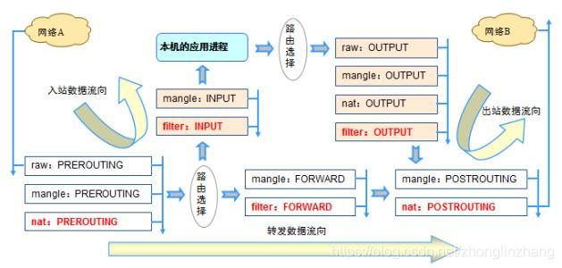

## iptables
- 4个表:filter,nat,mangle,raw.
- 5个链:PREROUTING,INPUT,FORWARD,OUTPUT,POSTROUTING,
- 4个表的优先级由高到低的顺序为:raw-->mangle-->nat-->filter

---
### 基本步骤如下
1. 数据包到达网络接口比 eth0
2. 进入 raw 表的 PREROUTING 链，这个链的作用是在连接跟踪之前处理数据包
3. 如果进行了连接跟踪，则进行处理
4. 进入 mangle 表的 PREROUTING 链，可以修改数据包，比如 TOS 等
5. 进入 nat 表的 PREROUTING 链，可以在此做 DNAT
6. 决定路由，看是交给本地主机还是转发给其它主机
---
### 一种情况就是数据包要转发给其它主机
- 进入 mangle 表的 FORWARD 链，这里也比较特殊，这是在第一次路由决定之后，在进行最后的路由决定之前，仍然可以对数据包进行某些修改
- 进入 filter 表的 FORWARD 链，可以对所有转发的数据包进行过滤。需要注意的是：经过这里的数据包是转发的，方向是双向的。  
- 进入 mangle 表的 POSTROUTING 链，到这里已经做完了所有的路由决定，但数据包仍然在本地主机，还可以进行某些修改。  
- 进入 nat 表的 POSTROUTING 链，在这里一般都是用来做 SNAT 
- 进入出去的网络接口。完毕。  -
- raw.PREROUTING -> mangle.PREROUTING -> nat.PREROUTING -> mangle.FORWARD -> filter.FORWARD -> mangle.POSTROUTING -> nat.POSTROUTING
---
### 另一种情况是，数据包就是发给本地主机的
7. 进入 mangle 表的 INPUT 链，这里是在路由之后，交由本地主机之前，也可以进行一些相应的修改
8. 进入 filter 表的 INPUT 链，在这里可以对流入的所有数据包进行过滤，无论它来自哪个网络接口
9. 交给本地主机的应用程序进行处理
10. 处理完毕后进行路由决定，看该发往哪里  
11. 进入 raw 表的 OUTPUT 链，这里是在连接跟踪处理本地的数据包之前
12. 连接跟踪对本地的数据包进行处理。  
13. 进入 mangle 表的 OUTPUT 链，在这里我们可以修改数据包  
14. 进入 nat 表的 OUTPUT 链，可以对防火墙自己发出的数据做 NAT 
15. 再次进行路由决定
16. 进入 filter 表的 OUTPUT 链，可以对本地出去的数据包进行过滤  
17. 进入 mangle 表的 POSTROUTING 链，同上一种情况的第9步。注意，这里不光对经过防火墙的数据包进行处理，还对防火墙自己产生的数据包进行处理。 
18. 进入 nat 表的 POSTROUTING 链
19. 进入出去的网络接口。完毕
raw.PREROUTING -> mangle.PREROUTING -> nat.PREROUTING -> mangle.INPUT -> filter.INPUT -> raw.OUTPUT -> mangle.OUTPUT -> nat.OUTPUT -> filter.OUTPUT -> mangle.POSTROUTING -> nat.POSTROUTING
---
> node的报文处理过程，报文处理过程中使用的标记位：使用了3个标记位，- 0xf0000 对应的标记位
- 0x10000:  报文的处理动作，置1表示放行，默认0表示拒绝
- 0x20000:  是否已经经过了policy规则检测，置1表示已经过
- 0x40000:  报文来源，置1，表示来自 host-endpoint
---
### mark值有何意义
> mark字段的值是一个无符号的整数，在32位系统上最大可以是4294967296（就是2的32次方），这足够用的了。比如对一个流或从某台机子发出的所有的包设置了mark值，就可以利用高级路由功能来对它们进行流量控制等操作了。mark值不是包本身的一部分，而是在包穿越计算机的过程中由内核分配的和它相关联的一个字段。它可能被用来改变包的传输路径或过滤。mark值只在本机有意义！在本机给包设置关联的mark值后，可通过该值对包后续的传输进行控制（排队，流量控制等）。mark的格式是--mark value[/mask]，如上面的例子是没有掩码的，带掩码的例子如--mark 1/1。如果指定了掩码，就先把mark值和掩码取逻辑与，然后再和包的mark值比较