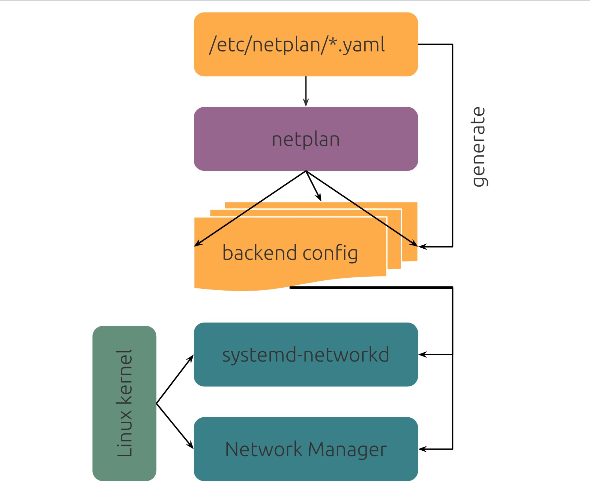

### 网络配置
---
从Ubuntu 18.04.2版本开始，系统的网络配置改成了新的 netplan.io 方式，弃用了之前使用的 ifupdown 方式。
1. 新旧版本对比
   > Ubuntu 18.04的DNS解析设置改成了 systemd-resolved，不是在原先 的配置文件 /etc/resolv.conf 设置了。
 
   > Ubuntu 18.04默认情况下不再安装ifupdown，因此命令ifup和ifdown 也不可用。可以使用ip命令来实现类似的功能，ip link set device  up 和 ip link set device down。
   
   > 之前Ubuntu16.04版本里的网卡配置文件 /etc/network/ interfaces  不起作用了，改成了netplan方式。
   
   > 如果新的 netplan 目前不能满足用户的网络使用需求，ifupdown 软 件包仍然可以在Ubuntu 中使用和支持。
   
   > ifupdown安装命令：apt install ifupdown 
2. netplan 是什么？
   > netplan官网说它是一个在Linux系统中简单方便配置网络的程序，使用YAML格式的文件进行配置。
3. netplan 的工作方式
   > netplan 从配置文件 /etc/netplan/*.yaml 读取网络配置，启动后 netplan 在 /run 目录中生成特定网卡名称后缀的配置文件，然后将网卡设备的控制权移交给特定的网络守护程序。
   
   > netplan 目前支持以下两种服务：
     - NetworkManager
     - Systemd-networkd
   > ubuntu 20.04系统里面查看网卡用netplan配置的信息
      ```bash
      root@vm01:~# networkctl status ens160
      ● 2: ens160
                   Link File: /usr/lib/systemd/network/99-default.link
                Network File: /run/systemd/network/10-netplan-ens160.network
                        Type: ether
                       State: routable (configured)
                        Path: pci-0000:03:00.0
                      Driver: vmxnet3
                      Vendor: VMware
                       Model: VMXNET3 Ethernet Controller
                  HW Address: 00:0c:29:eb:d3:61 (VMware, Inc.)
                         MTU: 1500 (min: 60, max: 9000)
        Queue Length (Tx/Rx): 4/4
            Auto negotiation: no
                       Speed: 10Gbps
                      Duplex: full
                        Port: tp
                     Address: 172.16.84.251 (DHCP4)
                              fe80::20c:29ff:feeb:d361
                     Gateway: 172.16.85.254
                         DNS: 223.5.5.5
                              114.114.114.114
           Activation Policy: up
         Required For Online: yes
                Connected To: GZHQ28_F_SW_04 on port Gi0/33 (GigabitEthernet3)
      
      Nov 04 06:39:02 vm01 systemd-networkd[779]: ens160: IPv6 successfullynabled
      Nov 04 06:39:02 vm01 systemd-networkd[779]: ens160: Link UP
      Nov 04 06:39:02 vm01 systemd-networkd[779]: ens160: Gained carrier
      Nov 04 06:39:03 vm01 systemd-networkd[779]: ens160: DHCPv4 address 16.  84               251/      23 via 172.16.85.254
      Nov 04 06:39:03 vm01 systemd-networkd[779]: ens160: Gained IPv6LL
      ```
4. 如何使用 netplan
   > 配置文件：/etc/netplan/*.yaml
   
   > 命令：netplan apply
   
   > 每个网卡都需要在 /etc/netplan 目录中设置配置文件，在配置中指定网卡ip信息，使用DHCP或者静态ip方式。
   
   > /etc/netplan/ 目录下的配置文件，扩展名为.yaml（例如 /etc/netplan/config.yaml），然后运行 netplan apply 此命令分析配置信息并将其应用生效。

   > 配置文件示例：
     ```yaml
     #网卡eth0使用dhcp方式配置ip网络，配置如下。yaml配置是用空格作为缩进对齐，不能使用tab键。
     network:
       version: 2
       renderer: networkd
       ethernets:
         eth0:
           dhcp4: yes
           dhcp6: no
     #网卡eth0使用静态ip方式，用关键字addresses指定ip地址和子网掩码（支持ipv4和ivp6），gateway4指定网关ip，nameservers 指定DNS。
     network:
       version: 2
       renderer: networkd
       ethernets:
         eth0:
           addresses:
             - 10.10.10.2/24
           gateway4: 10.10.10.1
           nameservers:
               search: [mydomain, otherdomain]
               addresses: [10.10.10.1, 1.1.1.1]
     ```
5. 配置文件里的关键字说明：
   > renderer：指定后端网络服务，支持networkd（Systemd-networkd） 和 NetworkManager两种，默认是networkd。
   
   > ethernets：指定是以太网配置，其他的还包括 wifis 或者 bridges
   
   > eth0：以太网网卡名称

   > dhcp4：开启使用ipv4的DHCP，默认是关闭。

   > dhcp6：开启使用ipv6的DHCP，默认是关闭。

   > addresses：对应网卡配置的静态ip地址，是ip/掩码的格式，支持ipv6地址，例如 addresses: [192.168.14.2/24, "2001:1::1/64"]
   
   > gateway4, gateway6：指定IPv4/6默认网关，使用静态ip配置时使用。例如IPv4: gateway4: 172.16.0.1 例如IPv6: gateway6: "2001:4::1"

   > nameservers：设置DNS服务器和搜索域。有两个受支持的字段：addresses:是DNS地址列表，search:是搜索域列表,没有特殊需要可以不配置search这项。

   > 更多配置项可以参考netplan.io文档 https://netplan.io/reference

---
#### 参考连接
- [Network Configuration](https://ubuntu.com/server/docs/network-configuration)
- [Ubuntu 18.04 网络配置介绍](https://developer.aliyun.com/article/744737)
---
### 网络安装
- 准备工作：
  - 部署dnsmasq，提供tftp、dhcp服务
    ```
    # 安装dnsmasq
    sudo apt install -y dnsmasq 
    
    # 配置文件
    cat > /etc/dnsmasq.conf.d/pxe.conf <EOF
    interface=<your interface>,lo
    bind-interfaces
    dhcp-range=<your interface>,192.168.0.100,192.168.0.200
    dhcp-boot=pxelinux.0
    dhcp-match=set:efi-x86_64,option:client-arch,7
    dhcp-boot=tag:efi-x86_64,bootx64.efi
    enable-tftp
    tftp-root=/var/lib/tftpboot
    EOF

    # 重启dnsmasq服务
    sudo systemctl restart dnsmasq.service

    # 配置引导文件，UEFI模式
    wget https://repo.huaweicloud.com/ubuntu-releases/20.04.2/ubuntu-20.04.2-live-server-amd64.iso
    mount ubuntu-20.04.2-live-server-amd64.iso /mnt
    cp /mnt/casper/{vmlinuz,initrd} /var/lib/tftpboot/

    # 配置引导文件，bios模式
    ```
  - web服务
  ```


https://ubuntu.com/server/docs/install/autoinstall