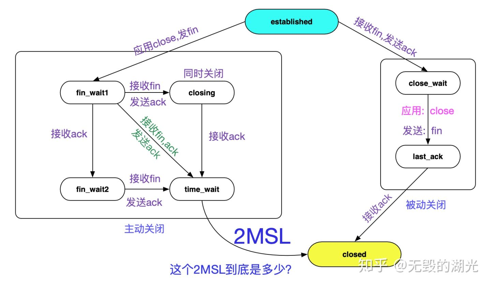

## 从Linux源码看TIME_WAIT状态的持续时间
从Linux源码看TIME_WAIT状态的持续时间
前言
笔者一直以为在Linux下TIME_WAIT状态的Socket持续状态是60s左右。线上实际却存在TIME_WAIT超过100s的Socket。由于这牵涉到最近出现的一个复杂Bug的分析。所以，笔者就去Linux源码里面，一探究竟。

首先介绍下Linux环境
TIME_WAIT这个参数通常和五元组重用扯上关系。在这里，笔者先给出机器的内核参数设置，以免和其它问题相混淆。

cat /proc/sys/net/ipv4/tcp_tw_reuse 0
cat /proc/sys/net/ipv4/tcp_tw_recycle 0
cat /proc/sys/net/ipv4/tcp_timestamps 1
可以看到，我们设置了tcp_tw_recycle为0,这可以避免NAT下tcp_tw_recycle和tcp_timestamps同时开启导致的问题。具体问题可以看笔者的以往博客。

https://my.oschina.net/alchemystar/blog/3119992
TIME_WAIT状态转移图
提到Socket的TIME_WAIT状态，不得就不亮出TCP状态转移图了:

持续时间就如图中所示的2MSL。但图中并没有指出2MSL到底是多长时间，但笔者从Linux源码里面翻到了下面这个宏定义。

#define TCP_TIMEWAIT_LEN (60*HZ) /* how long to wait to destroy TIME-WAIT
                  * state, about 60 seconds    */
如英文字面意思所示，60s后销毁TIME_WAIT状态，那么2MSL肯定就是60s喽？

持续时间真如TCP_TIMEWAIT_LEN所定义么?
笔者之前一直是相信60秒TIME_WAIT状态的socket就能够被Kernel回收的。甚至笔者自己做实验telnet一个端口号，人为制造TIME_WAIT，自己计时，也是60s左右即可回收。

但在追查一个问题时候，发现，TIME_WAIT有时候能够持续到111s,不然完全无法解释问题的现象。这就逼得笔者不得不推翻自己的结论，重新细细阅读内核对于TIME_WAIT状态处理的源码。当然，这个追查的问题也会写成博客分享出来，敬请期待^_^。

TIME_WAIT定时器源码
谈到TIME_WAIT何时能够被回收，不得不谈到TIME_WAIT定时器,这个就是专门用来销毁到期的TIME_WAIT Socket的。而每一个Socket进入TIME_WAIT时，必然会经过下面的代码分支:

tcp_v4_rcv
    |->tcp_timewait_state_process
        /* 将time_wait状态的socket链入时间轮
        |->inet_twsk_schedule
由于我们的kernel并没有开启tcp_tw_recycle,所以最终的调用为:

/* 这边TCP_TIMEWAIT_LEN 60 * HZ */
inet_twsk_schedule(tw, &tcp_death_row, TCP_TIMEWAIT_LEN,
                     TCP_TIMEWAIT_LEN);
好了，让我们按下这个核心函数吧。

inet_twsk_schedule
在阅读源码前，先看下大致的处理流程。Linux内核是通过时间轮来处理到期的TIME_WAIT socket，如下图所示:

内核将60s的时间分为8个slot(INET_TWDR_RECYCLE_SLOTS),每个slot处理7.5(60/8)范围time_wait状态的socket。

void inet_twsk_schedule(struct inet_timewait_sock *tw,struct inet_timewait_death_row *twdr,const int timeo, const int timewait_len)
{
    ......
    // 计算时间轮的slot
    slot = (timeo + (1 << INET_TWDR_RECYCLE_TICK) - 1) >> INET_TWDR_RECYCLE_TICK;
    ......
    // 慢时间轮的逻辑，由于没有开启TCP\_TW\_RECYCLE,timeo总是60*HZ(60s)
    // 所有都走slow_timer逻辑 
    if (slot >= INET_TWDR_RECYCLE_SLOTS) {
        /* Schedule to slow timer */
        if (timeo >= timewait_len) {
            slot = INET_TWDR_TWKILL_SLOTS - 1;
        } else {
            slot = DIV_ROUND_UP(timeo, twdr->period);
            if (slot >= INET_TWDR_TWKILL_SLOTS)
                slot = INET_TWDR_TWKILL_SLOTS - 1;
        }
        tw->tw_ttd = jiffies + timeo;
        // twdr->slot当前正在处理的slot
        // 在TIME_WAIT_LEN下，这个逻辑一般7
        slot = (twdr->slot + slot) & (INET_TWDR_TWKILL_SLOTS - 1);
        list = &twdr->cells[slot];
    } else{
        // 走短时间定时器，由于篇幅原因，不在这里赘述
        ......
    }
    ......
    /* twdr->period 60/8=7.5 */
    if (twdr->tw_count++ == 0)
        mod_timer(&twdr->tw_timer, jiffies + twdr->period);
    spin_unlock(&twdr->death_lock);
}
从源码中可以看到，由于我们传入的timeout皆为TCP_TIMEWAIT_LEN。所以，每次刚成为的TIME_WAIT状态的socket即将链接到当前处理slot最远的slot(+7)以便处理。如下图所示:

