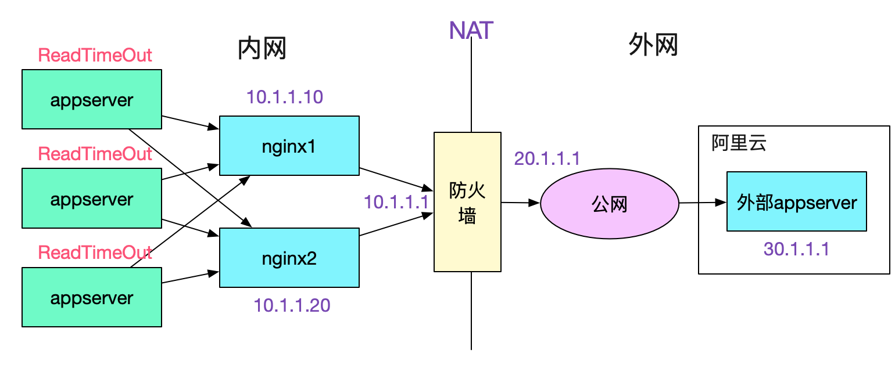
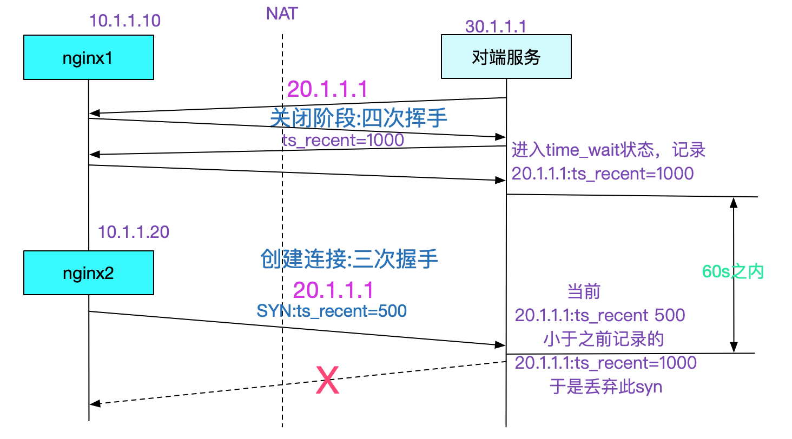

## 调用外网服务概率性失败问题的排查
- 由于内核参数调整不当导致网络连接失败
  - tcp_tw_recycle
  - tcp_timestamps

**故障描述**


**linux源码分析**

问题虽然解决了，但是笔者想从源码层面看一看这个问题到底是怎么回事，于是就开始研究对应的源码(基于linux-2.6.32源码)。 由于问题是发生在nginx与对端服务器第一次握手(即发送第一个syn)的时候，于是我们主要跟踪下这一处的相关源码:
```code
// 三次握手第一个SYN kernel走的分支
tcp_v4_do_rcv
	|->tcp_v4_hnd_req
	|->tcp_rcv_state_process
		/** case TCP_LISTEN && th->syn */
		|->conn_request(tcp_v4_conn_request)
```
关于tcp_timestamps的代码就在tcp_v4_conn_request里面,我们继续追踪(以下代码忽略了其它不必要的逻辑):
```code
int tcp_v4_conn_request(struct sock *sk, struct sk_buff *skb)
{
	......
	/* VJ's idea. We save last timestamp seen
	 * from the destination in peer table, when entering
	 * state TIME-WAIT, and check against it before
	 * accepting new connection request.
	 * 注释大意为:
	 * 我们在进入TIME_WAIT状态的时候将最后的时间戳记录到peer tables中，
	 * 然后在新的连接请求进来的时候检查这个时间戳
	 */
	 // 在tcp_timestamps和tcp_tw_recycle开启的情况下
	if (tmp_opt.saw_tstamp &&
	    tcp_death_row.sysctl_tw_recycle &&
	    (dst = inet_csk_route_req(sk, req)) != NULL &&
	    (peer = rt_get_peer((struct rtable *)dst)) != NULL &&
	    peer->v4daddr == saddr) {
		/** TCP_PAWS_MSL== 60 */
		/** TCP_PAWS_WINDOW ==1 */
		// 以下都是针对同一个对端ip
		// tcp_ts_stamp 对端ip的连接进入time_wait状态后记录的本机时间戳	
		// 当前时间在上一次进入time_wait记录的实际戳后的一分钟之内
		if (get_seconds() < peer->tcp_ts_stamp + TCP_PAWS_MSL &&
		// tcp_ts 最近接收的那个数据包的时间戳(对端带过来的)
		// 对端当前请求带过来的时间戳小于上次记录的进入time_wait状态后记录的对端时间戳
		    (s32)(peer->tcp_ts - req->ts_recent) >
						TCP_PAWS_WINDOW) {
			// 增加被动连接拒绝的统计信息
			NET_INC_STATS_BH(sock_net(sk), LINUX_MIB_PAWSPASSIVEREJECTED);
			// 进入丢弃和释放阶段
			goto drop_and_release;
		}
	}	
	......
}
```
上述代码的核心意思即是在tcp_timestamps和tcp_tw_recycle开启的情况下，同样ip的连接，在上个连接进入time_wait状态的一分钟内，如果有新的连接进来，而且新的连接的时间戳小于上个进入time_wait状态的最后一个包的时间戳，则将这个syn丢弃，进入drop_and_release。我们继续跟踪drop_and_release:
```code
int tcp_v4_conn_request(struct sock *sk, struct sk_buff *skb){
	......
	drop_and_release:
		dst_release(dst);
	drop_and_free:
		reqsk_free(req);
	drop:
		return 0;
}
```
我们继续看下如果tcp_v4_conn_request返回0的话，系统是什么表现:
```code
int tcp_rcv_state_process(struct sock *sk, struct sk_buff *skb,
			  struct tcphdr *th, unsigned len)
{
	......
	// 由于tcp_v4_conn_request所以不走下列分枝
	if (icsk->icsk_af_ops->conn_request(sk, skb) < 0)
		return 1
	// 所以此处也返回0
	kfree_skb(skb);
	return 0;
}
// 再跳回tcp_v4_do_rcv
int tcp_v4_do_rcv(struct sock *sk, struct sk_buff *skb)
{
	// 由于tcp_rcv_state_process这边返回的是0，所以不走reset的逻辑
	if (tcp_rcv_state_process(sk, skb, tcp_hdr(skb), skb->len)) {
		rsk = sk;
		goto reset;
	}
	// 走到这边之后，不发送reset包，不给对端任何响应
	TCP_CHECK_TIMER(sk);
	return 0;
}
```
从源码的跟踪可以看出，出现此种情况直接丢弃对应的syn包，对端无法获得任何响应从而进行syn重传，这点和抓包结果一致。

**和问题表象一一验证，为什么会出现一台nginx一直okay，一台nginx失败的情况**

由于tcp的时间戳是指的并不是当前本机用date命令给出的时间戳。这个时间戳的计算规则就在这里不展开了，只需要知道每台机器的时间戳都不相同即可(而且相差可能极大)。由于我们调用对端采用的是NAT，所以两台nginx在对端服务器看来是同一个ip,那么这两台的时间戳发送到对端服务器的时候就会混乱。nginx1的时间戳比nginx2的时间戳大,所以在一分钟之内，只要出现nginx1的连接请求(短连接)，那么之后的nginx2的连接请求就会一直被丢弃。如下图所示:



**为什么对端自测一直正常**

因为本机调用本机的时时间戳是一台机器(本机)上的，所以不会出现混乱。

**为什么nginx2调用其它服务是正常的**

因为其它外部服务所在服务器并没有开启tcp_tw_recycle。这个问题事实上将tcp_tw_recycle置为0也可以解决。另外，高版本的linux内核已经去掉了tcp_tw_recycle这个参数。

**总结**

由于当前ip地址紧缺和DNS报文大小的限制(512字节),大部分网络架构都是采用NAT的方式去和外部交互，所以设置了tcp_tw_recycle为1基本都会出现问题。一般这种问题需要对tcp协议有一定的了解才能够顺藤摸瓜找到最终的根源。
---
## 参考信息
- [解Bug之路-记一次调用外网服务概率性失败问题的排查](https://my.oschina.net/alchemystar/blog/3119992)