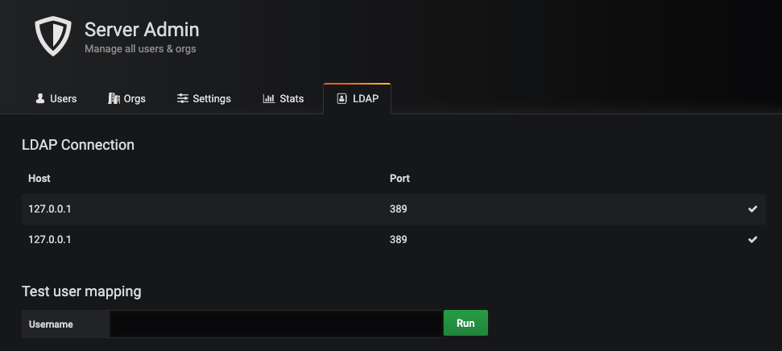
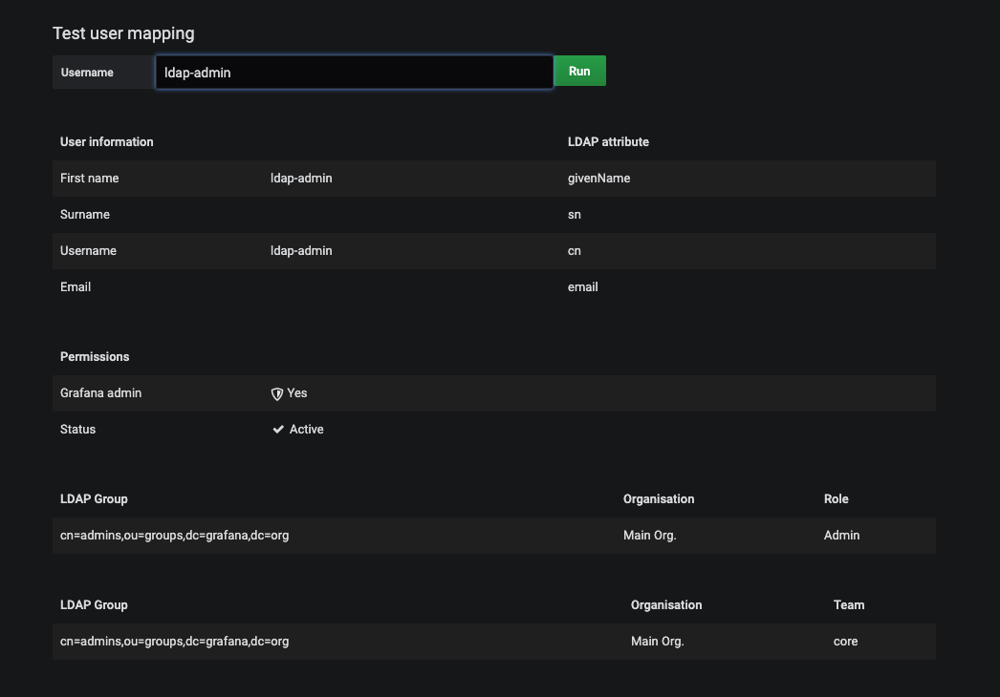

# zabbix使用grafana展示图形
* 安装Zabbix插件；
```bash
grafana-cli plugins install alexanderzobnin-zabbix-app
service grafana-server restart
```
* 登陆web界面；访问Configuration - Plugins - Zabbix - enabled
* 配置Data Source；访问Configuration - Data Sources - Zabbix - Settings，配置以下选项后，点击Save & Test测试保存
  * zabbix 的api接口
  * zabbix的版本
  * 直连zabbix数据库（需要在grafana的Data Sources中配置MySQL数据源连接zabbix-DB）
* 配置Zabbix的Dashboards；访问Configuration - Data Sources - Zabbix - Dashboards。点击import。


## 出现Panel plugin not found: grafana-piechart-panel
- 执行grafana-cli plugins install grafana-piechart-panel，安装插件
- 重启grafana，kubectl -n monitoring rollout restart deploy grafana

## 重置grafana的密码
- grafana-cli admin reset-admin-password admin

## 配置OpenLDAP密码验证
- 修改ldap.toml配置文件，配置OpenLDAP服务器信息，search_dn，用户组的权限
  ```bash
  [[servers]]
  # Ldap server host (specify multiple hosts space separated)
  host = "127.0.0.1"
  # Default port is 389 or 636 if use_ssl = true
  port = 389
  # Set to true if LDAP server supports TLS
  use_ssl = false
  # Set to true if connect LDAP server with STARTTLS pattern (create connection in insecure, then upgrade to secure   connection with TLS)
  start_tls = false
  # set to true if you want to skip SSL cert validation
  ssl_skip_verify = false
  # set to the path to your root CA certificate or leave unset to use system defaults
  # root_ca_cert = "/path/to/certificate.crt"
  # Authentication against LDAP servers requiring client certificates
  # client_cert = "/path/to/client.crt"
  # client_key = "/path/to/client.key"
  
  # Search user bind dn
  bind_dn = "cn=admin,dc=grafana,dc=org"
  # Search user bind password
  # If the password contains # or ; you have to wrap it with triple quotes. Ex """#password;"""
  bind_password = 'grafana'
  
  # User search filter, for example "(cn=%s)" or "(sAMAccountName=%s)" or "(uid=%s)"
  # Allow login from email or username, example "(|(sAMAccountName=%s)(userPrincipalName=%s))"
  search_filter = "(cn=%s)"
  
  # An array of base dns to search through
  search_base_dns = ["dc=grafana,dc=org"]
  
  # group_search_filter = "(&(objectClass=posixGroup)(memberUid=%s))"
  # group_search_filter_user_attribute = "distinguishedName"
  # group_search_base_dns = ["ou=groups,dc=grafana,dc=org"]
  
  # Specify names of the LDAP attributes your LDAP uses
  [servers.attributes]
  member_of = "memberOf"
  email =  "email"
  ```
- 修改grafana主配置文件，开启ldap认证。配置完成后重启grafana服务
  ```bash
  [auth.ldap]
  # Set to `true` to enable LDAP integration (default: `false`)
  enabled = true
  
  # Path to the LDAP specific configuration file (default: `/  etc/grafana/ldap.toml`)
  config_file = /etc/grafana/ldap.toml
  allow_sign_up = false
  ```
- 在Grafana的web ui上，使用LDAP Debug。grafana的版本大于6.4。使用管理员账号登录，进入Server Admin
- 展示ldap的配置信息

- 使用调试视图

---
## 参考连接
- https://cloud.tencent.com/developer/article/1027332
- https://github.com/yangcvo/Grafana
- http://docs.grafana.org/features/panels/singlestat/
- [Grafana LDAP Authentication](https://grafana.com/docs/grafana/latest/auth/ldap/)
