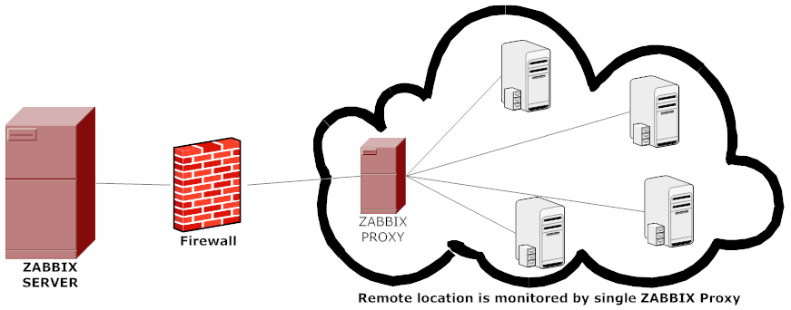

## zabbix-proxy使用架构

## zabbix-proxy的源码安装
./configure --enable-proxy --with-mysql
make
make install

## 新建数据库，zabbix-proxy只需要schema.sql
mysql> create database zabbix-proxy;
mysql> source schema.sql;

## zabbix-proxy启动，安装路径/usr/local/zabbix
/usr/local/zabbix/sbin/zabbix_proxy -c /usr/local/zabbix/etc/zabbix_proxy.conf

## 使用 config_cache_reload 选项重新加载 proxy 的配置缓存
/usr/local/zabbix/sbin/zabbix_proxy -c /usr/local/zabbix/etc/zabbix_proxy.conf

## web 界面配置
Administration -> Proxies -> Create proxy
其中Proxy name必须与proxy配置文件中的Hostname一致
