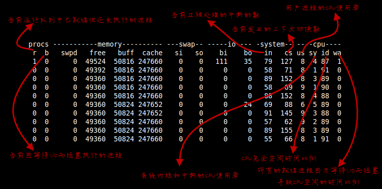
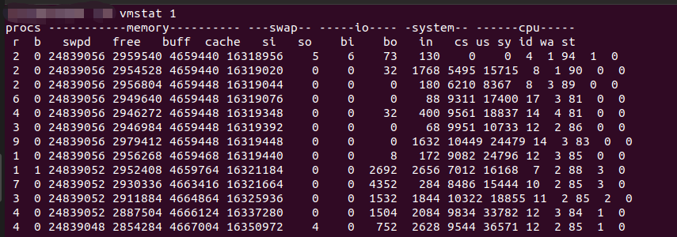
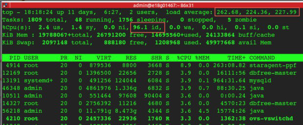

## CPU load高，但CPU使用却在20%

* 查询状态为D的程序
    ```bash
    ps -eTo stat,pid,ppid,comm --no-header|sed -e 's/^ *//'|tr -s ' '|grep -v CPU|sort
    ```
* 物理机上跑docker，检查容器是否绑定在某一个逻辑CPU上。同一时间点所有物理机同时批量执行docker update 把几百个容器都绑定到CPU1上，导致这个核忙死了，其它核闲得要死（所以看到整体CPU不忙，最忙的那个核被平均掩盖掉了），但是Load高（CPU1上排队太长，即使平均到32个核，这个队列还是长，这就是瓶颈啊）。
    ```bash
    for i in `docker ps -aq
    do
        echo $i
        docker inspect $1|grep CpusetCpus
    done
    ```

* vmstat每个字段的解析

* 使用vmstat检查发现run状态的进程平均10，break中断基本维持在0。但load averages却维持在50，使用top检查，cpu的idle在80%，说明有进程在队列等待，但没有使用CPU运算，导致load虚高


## 参考信息
* https://zhuanlan.zhihu.com/p/33941811
* http://einverne.github.io/post/2019/03/cpu-load.html